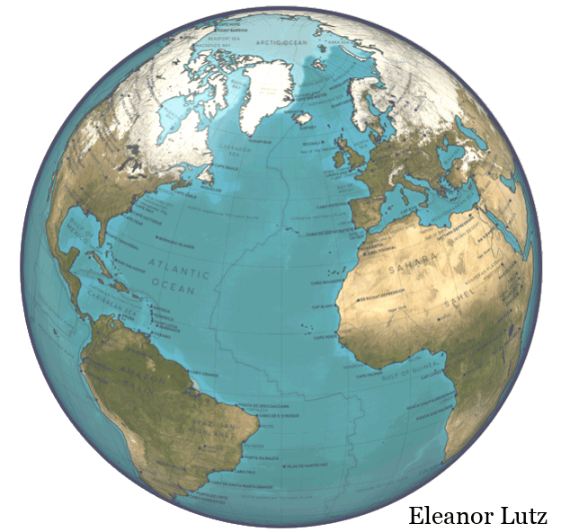

# Awesome Sustainable Technology 
<!--lint ignore double-link-->
[  ](https://protontypes.eu/)
__Open source projects sustaining stable climate, energy supply and vital natural resources__
> For technology to be truly sustainable, it must be globally available, free and independent. The open and free distribution of sustainable technology provides the basis for an economical and ecological global economy.  This secures the access to vital resources such as stable climate, soil or water for everyone in the long term.

 

Your contribution is necessary to keep this list alive, increase the quality and to expand it. You can read more about it's origin and how you can participate in the [contribution guide](contributing.md) and related [blog post](https://protontypes.eu/blog/2020/10/05/gathering-open-sustainable-technology/).

## Contents

- [Renewable Energy](#renewable-energy)
  - [Photovoltaic and Solar Energy](#photovoltaic-and-solar-energy)
  - [Wind Turbines](#wind-turbines)
  - [Hydro Energy](#hydro-energy)
  - [Geothermal Energy](#geothermal-energy)
  - [Bioenergy](#bioenergy)
- [Energy Storage](#energy-storage)
  - [Battery](#battery)
  - [Hydrogen](#hydrogen)
- [Energy Distribution and Grids](#energy-distribution-and-grids)
- [Energy Consumption](#energy-consumption)
  - [Buildings and Cities](#buildings-and-cities)
  - [Mobility and Transportation](#mobility-and-transportation)
  - [Industry](#industry)
- [Energy System Assessment](#energy-system-assessment)
  - [Modeling](#modeling)
  - [Analysis](#analysis)
  - [Optimization](#optimization)
  - [Monitoring and Control](#monitoring-and-control)
- [Datasets on Electricity Consumption and Generation](#datasets-on-electricity-consumption-and-generation)
- [Emissions and Greenhouse Gases](#emissions-and-greenhouse-gases)
  - [Carbon Footprint](#carbon-footprint)
  - [Observation](#observation)
  - [Carbon Capture](#carbon-capture)
- [Observation and Models of Ecosystems](#observation-and-models-of-ecosystems)
  - [Vegetation and Biodiversity](#vegetation-and-biodiversity)
  - [Ice and Poles](#ice-and-poles)
  - [Ocean and Climate](#ocean-and-climate)
- [Datasets of Ecosystems](#datasets-of-ecosystems)
- [Access and Monitoring of Resources](#access-and-monitoring-of-resources)
  - [Air and Atmosphere](#air-and-atmosphere)
  - [Water](#water)
  - [Soil](#soil)
- [Circular Economy and Waste](#circular-economy-and-waste)
- [Further Online Resources](#further-online-resources)
- [Sustainable Technology Communities](#sustainable-technology-communities)

## Renewable Energy
### Photovoltaic and Solar Energy
- [pvlib-python](https://github.com/pvlib/pvlib-python) - A set of documented functions for simulating the performance of photovoltaic energy systems.
- [pvfactors](https://github.com/SunPower/pvfactors) - Open-source view-factor model for diffuse shading and bifacial PV modeling.
- [gsee](https://github.com/renewables-ninja/gsee) -  Global Solar Energy Estimator.
- [PVMismatch](https://github.com/SunPower/PVMismatch) - An explicit Python PV system IV & PV curve trace calculator which can also calculate mismatch.
- [rdtools](https://github.com/NREL/rdtools) - Is an open-source library to support reproducible technical analysis of time series data from photovoltaic energy systems.
- [Machine-Learning-for-Solar-Energy-Prediction](https://github.com/ColasGael/Machine-Learning-for-Solar-Energy-Prediction) - Predict the power production of a solar panel farm from weather measurements using machine learning.
- [elpv-dataset](https://github.com/zae-bayern/elpv-dataset) - A dataset of functional and defective solar cells extracted from EL images of solar modules.
- [feedinlib](https://github.com/oemof/feedinlib) - Contains implementations of photovoltaic models to calculate electricity generation from a pv installation based on given solar radiation. Furthermore it contains all necessary pre-calculations.
- [photovoltaic](https://github.com/pvedu/photovoltaic) - A library of python functions used in photovoltaics.
- [pvcaptest](https://github.com/pvcaptest/pvcaptest) - Collection of functions and jupyter notebooks to partially automate running a capacity test following ASTM E2848.
- [pvtrace](https://github.com/danieljfarrell/pvtrace) - Optical ray tracing for luminescent materials and spectral converter photovoltaic devices.
- [SolarPILOT](https://github.com/NREL/SolarPILOT) - Solar power tower layout and optimization tool.
- [solar-data-tools](https://github.com/slacgismo/solar-data-tools) - Some data analysis tools for working with historical PV solar time-series data sets.
- [SolarPV-DER-simulation-utility](https://github.com/sibyjackgrove/SolarPV-DER-simulation-utility) -  Allows user to run dynamics simulations for solar photovoltaic distributed energy resource connected to a stiff voltage source or to an external program.
- [bifacial_radiance](https://github.com/NREL/bifacial_radiance) - Toolkit for working with RADIANCE for the ray-trace modeling of Bifacial Photovoltaics.
- [autoXRD](https://github.com/PV-Lab/autoXRD) - A python package for automatic XRD pattern classification of thin-films, tweaked for small and class-imbalanced datasets.
- [BayesProcess](https://github.com/PV-Lab/BayesProcess) - A python package for Physics informed Bayesian network inference using neural network surrogate model for matching process / variable / performance in solar cells.
- [solcore5](https://github.com/qpv-research-group/solcore5) - A multi-scale, python-based library for the modelling of solar cells and semiconductor materials.
- [solax](https://github.com/squishykid/solax) - Read energy usage data from the real-time API on Solax solar inverters.
- [bifacialvf](https://github.com/NREL/bifacialvf) - Bifacial PV View Factor model for system performance calculation.
- [solar](https://github.com/oscarperpinan/solar) - Allows for reproducible research both for photovoltaics systems performance and solar radiation.
- [SolarTherm](https://github.com/SolarTherm/SolarTherm) - Solar thermal power/fuel station performance simulation and optimization using Modelica.
- [Charge Controller Firmware](https://github.com/LibreSolar/charge-controller-firmware) - Firmware for Libre Solar MPPT/PWM charge controllers.
- [pvoutput](https://github.com/openclimatefix/pvoutput) - Python code for downloading PV data from PVOutput.org.
- [predict_pv_yield](https://github.com/openclimatefix/predict_pv_yield) - Use machine learning to map from satellite imagery of clouds to solar PV yield.
- [solar-panel-detection](https://github.com/alan-turing-institute/solar-panel-detection) - Using a combination of AI (machine vision), open data and short term forecasting, the project aims to determine the amount of solar electricity being put into the UK grid at a given time (i.e., “right now”, or “nowcasting”)
- [solarpy](https://github.com/aqreed/solarpy) - This packages aims to provide a reliable solar radiation model, mainly based on the work of Duffie, J.A., and Beckman, W. A., 1974, "Solar energy thermal processes".
- [solariot](https://github.com/meltaxa/solariot) - Leverage your IoT enabled Solar PV Inverter to stream your solar energy usage data to a real time dashboard.
- [pvanalytics](https://github.com/pvlib/pvanalytics) - Quality control, filtering, feature labeling, and other tools for working with data from photovoltaic energy systems.
- [IonMonger](https://github.com/PerovskiteSCModelling/IonMonger) - A free and fast perovskite solar cell simulator with coupled ion vacancy and charge carrier dynamics in one dimension.
- [rayflare](https://github.com/qpv-research-group/rayflare) - Provide a flexible, user-friendly Python environment to model complex optical stacks, with a focus on solar cells.

### Wind Turbines

- [IEA-15-240-RWT](https://github.com/IEAWindTask37/IEA-15-240-RWT) - A 15 MW reference wind turbine repository developed in conjunction with IEA Wind.
- [makani](https://github.com/google/makani) - Was a project to develop a commercial-scale airborne wind turbine, culminating in a flight test of the Makani M600 off the coast of Norway.
- [windpowerlib](https://github.com/wind-python/windpowerlib) - The windpowerlib is a library to model the output of wind turbines and farms.
- [turbinesFoam](https://github.com/turbinesFoam/turbinesFoam) - A library for simulating wind and marine hydrokinetic turbines in OpenFOAM using the actuator line method.
- [nalu-wind](https://github.com/Exawind/nalu-wind) - Solver for wind farm simulations targeting exascale computational platforms.
- [openfast](https://github.com/OpenFAST/openfast) - Was created with the goal of being a community model developed and used by research laboratories, academia, and industry.
- [amr-wind](https://github.com/Exawind/amr-wind) - A massively parallel, block-structured adaptive-mesh, incompressible flow sover for wind turbine and wind farm simulations.
- [QBlade](http://www.q-blade.org/#welcome) - Provides a hands on design and simulation capabilities for HAWT and VAWT rotor design and shows all the fundamental relationships of design concepts and turbine performance in an easy and intuitive way.
- [OpenOA](https://github.com/NREL/OpenOA) - This library provides a framework for working with large timeseries data from wind plants, such as SCADA.
- [ROSCO](https://github.com/NREL/ROSCO) - NREL's Reference OpenSource Controller for wind turbine applications.
- [floris](https://github.com/NREL/floris) - A controls-oriented engineering wake model.
- [windtools](https://github.com/FZJ-IEK3-VSA/windtools) - The Wind Energy Generation Tools provides useful tools to assist in wind energy simulations.
- [PyWake](https://gitlab.windenergy.dtu.dk/TOPFARM/PyWake) - An AEP calculator for wind farms implemented in Python including a collection of wake models.
- [WISDEM](https://github.com/WISDEM/WISDEM) - Wind Plant Integrated System Design and Engineering Model.
- [LandBOSSE](https://github.com/WISDEM/LandBOSSE) - The Land-based Balance-of-System Systems Engineering model is a systems engineering tool that estimates the balance-of-system costs associated with installing utility scale wind plants (10, 1.5 MW turbines or larger).
- [OpenMDAO](https://github.com/OpenMDAO/OpenMDAO) - Optimization of Aerodynamic systems.
- [TopFarm2](https://gitlab.windenergy.dtu.dk/TOPFARM/TopFarm2) - A Python package developed by DTU Wind Energy to help with wind-farm optimizations.
- [BasicDTUController](https://gitlab.windenergy.dtu.dk/OpenLAC/BasicDTUController) - The scope of this project is to provide an open-source open-access controller that can be used by the wind energy community as a reference.
- [WindEnergyToolbox](https://gitlab.windenergy.dtu.dk/toolbox/WindEnergyToolbox) - Is a collection of Python scripts that facilitate working with (potentially a lot) of HAWC2,HAWCStab2, FAST or other text input based simulation tools.
- [windfarmGA](https://github.com/YsoSirius/windfarmGA) - Genetic algorithm to optimize the layout of windfarms.
- [wtphm](https://github.com/lkev/wtphm) - The Wind Turbine Prognostics and Health Management library processes wind turbine events data, as well as operational SCADA data for easier fault detection, prognostics or reliability research.
- [AirfoilPreppy](https://github.com/WISDEM/AirfoilPreppy) - A Python module for preprocessing and evaluating aerodynamic airfoil data, primarily for wind turbine applications.
- [GreenGuard](https://github.com/signals-dev/GreenGuard) - Is a collection of end-to-end solutions for machine learning problems commonly found in monitoring wind energy production system.
- [pv-terms](https://github.com/DuraMAT/pv-terms) - Contains nomenclature for PV-relevant terms that are used in modeling and data analysis for PV systems.
- [pyconturb](https://gitlab.windenergy.dtu.dk/pyconturb/pyconturb) - Constrained Stochastic Turbulence for Wind Energy Applications.

### Hydro Energy
- [WecOptTool](https://github.com/SNL-WaterPower/WecOptTool) - Allows users to perform wave energy converter device design optimization studies with constrained optimal control.
- [CACTUS](https://github.com/SNL-WaterPower/CACTUS) - A turbine performance simulation code, based on a free wake vortex method, to study wind turbines and marine hydrokinetic devices.
- [hydro-power-database](https://github.com/energy-modelling-toolkit/hydro-power-database) - Tries to collect some basic information on all the European hydro-power plants.
- [MHKiT-Python](https://github.com/MHKiT-Software/MHKiT-Python) - Provides the marine renewable energy community tools for data processing, visualization, quality control, resource assessment, and device performance.
- [hydropowerlib](https://github.com/hydro-python/hydropowerlib) - The hydropowerlib is designed to calculate feedin time series of run-of-the-river hydropower plants.
- [HydroPowerSimulations.jl](https://github.com/NREL-SIIP/HydroPowerSimulations.jl) - Contains extensions on PowerSystems.jl and PowerSimulations.jl to enable enhanced hydropower representations.
- [OpenHPL](https://github.com/simulatino/OpenHPL) - An open-source hydropower library that consists of hydropower unit models and is modelled using Modelica.
- [WEC-Sim](https://github.com/WEC-Sim/WEC-Sim) - Wave Energy Converter Simulator is an open-source code for simulating wave energy converters.

### Geothermal Energy
- [pygfunction](https://github.com/MassimoCimmino/pygfunction) - An open-source toolbox for the evaluation of thermal response factors of geothermal borehole fields.
- [geothermics](https://github.com/Japhiolite/geothermics) - Educational repository with Jupyter Notebooks all around the topic of geothermal energy.
- [energy2d](https://github.com/charxie/energy2d) - Interactive Heat Transfer Simulations for Everyone.
- [OpenGeoSys 6](https://gitlab.opengeosys.org/ogs/ogs) - Is a scientific open source project for the development of numerical methods for the simulation of thermo hydro-mechanical-chemical processes in porous and fractured media.
- [FEHM](https://github.com/lanl/FEHM) - Has proved to be a valuable asset on a variety of projects of national interest including Environmental Remediation of the Nevada Test Site, the LANL Groundwater Protection Program, geologic CO2 sequestration, Enhanced Geothermal Energy programs, Oil and Gas production, Nuclear Waste Isolation, and Arctic Permafrost.
- [thermo](https://github.com/CalebBell/thermo) - Thermodynamics, phase equilibria, transport properties and chemical database component of Chemical Engineering Design Library.

### Bioenergy
- [sashahafner/biogas](https://github.com/sashahafner/biogas) - Tools for biogas research in R: process biogas data and predict biogas production.
- [biosteam](https://github.com/BioSTEAMDevelopmentGroup/biosteam) - The Biorefinery Simulation and Techno-Economic Analysis Modules.
- [Multiscale_Ulva](https://github.com/alexliberzonlab/Multiscale_Ulva) - Is a multi-reactor, algae farm, simulation base function that will be solved in time.
- [BioSTEAM_LCA](https://github.com/scyjth/biosteam_lca) - is an an agile life cycle assessment (LCA) platform that enables the fast and flexible evaluation of the life cycle environmental impacts of biorefineries under uncertainty.

## Energy Storage

### Battery
- [foxBMS](https://github.com/foxBMS/foxbms) -  A free, open and flexible development environment to design battery management systems. It is the first modular open source BMS development platform.
- [impedance.py](https://github.com/ECSHackWeek/impedance.py) - A Python package for working with electrochemical impedance data.
- [PyBaMM](https://github.com/pybamm-team/PyBaMM) - Fast and flexible physics-based battery models in Python.
- [ENNOID-BMS](https://github.com/EnnoidMe/ENNOID-BMS) - Open-Source: Modular BMS based on LTC68XX & STM32 MCU for up to 400V EV battery pack.
- [cellpy](https://github.com/jepegit/cellpy) - Extract and tweak data from electrochemical tests of batterie cells.
- [prediction-of-battery-cycle](https://github.com/rdbraatz/data-driven-prediction-of-battery-cycle-life-before-capacity-degradation) - Data driven prediciton of battery cycle life before capacity degradation.
- [BatterySense](https://github.com/rlogiacco/BatterySense) - This is a simple Arduino library to monitor battery consumption of your battery powered projects, being LiPo, LiIon, NiCd or any other battery type, single or multiple cells: if it can power your Arduino you can monitor it.
- [beep](https://github.com/TRI-AMDD/beep) - A set of tools designed to support Battery Evaluation and Early Prediction of cycle life corresponding to the research of the d3batt program and the Toyota Research Institute.
- [snl-quest](https://github.com/snl-quest/snl-quest) - An open source, Python-based software application suite for energy storage simulation and analysis developed by Sandia National Laboratories.
- [simses](https://gitlab.lrz.de/open-ees-ses/simses) - Software for techno-economic Simulation of Stationary Energy Storage Systems.
- [CAEBAT OAS](https://vibe.ornl.gov/#introduction) - A flexible, robust, and computationally scalable open-architecture framework that integrates multi-physics and multi- scale battery models.
- [universal-battery-database](https://github.com/Samuel-Buteau/universal-battery-database) - The Universal Battery Database is an open source software for managing Lithium-ion cell data.
- [open_BEA](https://gitlab.lrz.de/open-ees-ses/openbea) - Open Battery Models for Electrical Grid Applications.
- [lp_opt](https://gitlab.lrz.de/open-ees-ses/lp_opt) - Linear Programming Optimization Tool for Battery Energy Storage Systems.
- [SLIDE](https://github.com/davidhowey/SLIDE) - SLIDE is a C++ code that simulates degradation of lithium ion cell.
- [equiv-circ-model](https://github.com/batterysim/equiv-circ-model) - An equivalent circuit model for a battery cell, module, and pack.
- [long-live-the-battery](https://github.com/dsr-18/long-live-the-battery) - Predicting total battery cycle life time with machine learning.
- [ISEAFramework](https://github.com/FHust/ISEAFramework) - Allows coupled electrical-thermal simulations of single storage systems (e.g. lithium ion batteries or double layer capacitors) or complete storage system packs.
- [Ampere](https://github.com/nealde/Ampere) - Advanced Model Package for ElectRochemical Experiments.
- [StorageVET](https://github.com/epri-dev/StorageVET) - A valuation model for analysis of energy storage technologies and some other energy resources paired with storage.
- [offgridsystems](https://github.com/offgridsystems/Documents) - Data sheet and assembly manual, component data sheets, busbars and files needed to build no-weld wireless BMS DKblock style battery packs.

### Hydrogen
- [OPEM](https://github.com/ECSIM/opem) - Is a modeling tool for evaluating the performance of proton exchange membrane fuel cells.
- [gopem](https://github.com/ECSIM/gopem) - GOPEM is a graphical user interface of OPEM.
- [pem-dataset1](https://github.com/ECSIM/pem-dataset1) - Proton Exchange Membrane Fuel Cell Dataset.
- [HIM](https://github.com/FZJ-IEK3-VSA/HIM) - Hydrogen Infrastructure model for the analysis of spatially resolved hydrogen infrastructure pathways.
- [pandapipes](https://github.com/e2nIEE/pandapipes) - A pipeflow calculation tool that complements pandapower in the simulation of multi energy grids, in particular heat and gas networks.
- [The Hydrogen Risk Assessment Models](https://github.com/sandialabs/hyram) - Is the first-ever software toolkit that integrates deterministic and probabilistic models for quantifying accident scenarios, predicting physical effects, and characterizing hydrogen hazards impact on people and structures.
- [GasModels.jl](https://github.com/lanl-ansi/GasModels.jl) - A Julia/JuMP Package for Gas Network Optimization.

## Energy Distribution and Grids
- [SimBench](https://github.com/e2nIEE/simbench) - The objective of the research project SimBench is the development of a benchmark dataset to support research in grid planning and operation.
- [Egret](https://github.com/grid-parity-exchange/Egret) - A Python-based package for electrical grid optimization based on the Pyomo optimization modeling language.
- [PyPSA-Eur](https://github.com/PyPSA/pypsa-eur) - An Open Optimization Model of the European Transmission System.
- [Energy Transition Engine](https://github.com/quintel/etengine) - Calculation engine for the Energy Transition Model.
- [Open Smart Grid Platform](https://github.com/OSGP/open-smart-grid-platform) - An open, generic, scalable and independent 'Internet of Things' platform, which enables various connected smart objects in the public space to be easily controlled and monitored.
- [PowerModels.jl](https://github.com/lanl-ansi/PowerModels.jl) - Designed to enable computational evaluation of emerging power network formulations and algorithms in a common platform.
- [PowerModelsAnnex.jl](https://github.com/lanl-ansi/PowerModelsAnnex.jl) - An extension of PowerModels.jl that provides a home for open-source sharing of preliminary and/or exploratory methods in power system optimization.
- [Power Grid Lib](https://github.com/power-grid-lib/pglib-opf) - This benchmark library is curated and maintained by the IEEE PES Task Force on Benchmarks for Validation of Emerging Power System Algorithms and is designed to evaluate a well established version of the the AC Optimal Power Flow problem.
- [pypownet](https://github.com/MarvinLer/pypownet) - A power network simulator with a Reinforcement Learning-focused usage.
- [Grid2Op](https://github.com/rte-france/Grid2Op) -  A testbed platform to model sequential decision making in power systems.
- [eDisGo](https://github.com/openego/eDisGo/) - Optimization of flexibility options and grid expansion for distribution grids based on PyPSA.
- [offgridders](https://github.com/rl-institut/offgridders) - Models and optimizes capacity & dispatch of electricity supply systems, off-grid or connected to a (weak) central grid.
- [RTS-GMLC](https://github.com/GridMod/RTS-GMLC) - Reliability Test System of the Grid Modernization Lab Consortium.
- [openmodelica-microgrid-gym](https://github.com/upb-lea/openmodelica-microgrid-gym) - An OpenAI Gym Environment for Microgrids.
- [OpenDSS](https://sourceforge.net/projects/electricdss/) - An electric power Distribution System Simulator for supporting distributed resource integration and grid modernization efforts.
- [PowerDynamics.jl](https://github.com/JuliaEnergy/PowerDynamics.jl) - Provides all the tools you need to create a dynamic power grid model and analyze it.
- [InfrastructureSystems.jl](https://github.com/NREL-SIIP/InfrastructureSystems.jl) - Provides utilities to support data models for infrastructure modeling in NREL-SIIP.
- [openleadr](https://www.lfenergy.org/projects/openleadr/) - Open Automated Demand Response (OpenADR) is an open and interoperable information exchange model and emerging smart grid standard.
- [GridCal](https://github.com/SanPen/GridCal) - Aims to be a complete platform for power systems research and simulation.
- [pyehub](https://gitlab.com/energyincities/python-ehub) - A python-based, modular and nestable implementation of the Energy Hub model (balancing demand and supply, system capacity sizing and network flows using Mixed-Integer Linear Programming).

## Energy Consumption

### Buildings and Cities

- [hpxml](https://github.com/hpxmlwg/hpxml) - Home Performance XML is a data transfer standard for the home performance industry.
- [HPXML to Home Energy Score Translator](https://github.com/NREL/hescore-hpxml) - This translator script takes an HPXML file or directory of files as an input and generates HEScore inputs from it.
- [LoadProfileGenerator](https://github.com/FZJ-IEK3-VSA/LoadProfileGenerator) - Program for generating load curves for residential consumers. Agentbased and extremly detailed.
- [The-building-data-genome-project](https://github.com/buds-lab/the-building-data-genome-project) - A collection of non-residential buildings for performance analysis and algorithm benchmarking.
- [VOLTTRON](https://github.com/VOLTTRON/volttron) - The platform provides services for collecting and storing data from buildings and devices and provides an environment for developing applications which interact with that data.
- [EnergyPlus](https://github.com/NREL/EnergyPlus) -  A whole building energy simulation program that engineers, architects, and researchers use to model both energy consumption and water use in buildings.
- [OpenStudio](https://github.com/NREL/OpenStudio) -  A cross-platform collection of software tools to support whole building energy modeling using EnergyPlus and advanced daylight analysis using Radiance.
- [BEMServer](https://github.com/HIT2GAP-EU-PROJECT/bemserver) - An open source Python server to deploy energy management solutions for buildings.
- [SEED](https://github.com/SEED-platform/seed) - Standard Energy Efficiency Data Platform™ is a web-based application that helps organizations easily manage data on the energy performance of large groups of buildings.
- [HPWHsim](https://github.com/EcotopeResearch/HPWHsim) - An open source simulation model for Heat Pump Water Heaters (HPWH).
- [OpenStudio-ERI](https://github.com/NREL/OpenStudio-ERI) - Calculates an Energy Rating Index (ERI) via an OpenStudio/EnergyPlus-based workflow. Building information is provided through an HPXML file.
- [OpenStudio-HPXML](https://github.com/NREL/OpenStudio-HPXML) - Modeling of residential buildings in EnergyPlus using OpenStudio/HPXML.
- [AixLib](https://github.com/RWTH-EBC/AixLib) - A Modelica model library for building performance simulations.
- [TEASER](https://github.com/RWTH-EBC/TEASER) - Tool for Energy Analysis and Simulation for Efficient Retrofit.
- [pyCity](https://github.com/RWTH-EBC/pyCity) - Python package for data handling and scenario generation of city districts and urban energy systems.
- [tespy](https://github.com/oemof/tespy) - Provides a powerful simulation toolkit for thermal engineering plants such as power plants, district heating systems or heat pumps.
- [RC_BuildingSimulator](https://github.com/architecture-building-systems/RC_BuildingSimulator) - A Resistance Capacitance Model for an Energetic Simulation of a Building.
- [CEA](https://github.com/architecture-building-systems/CityEnergyAnalyst) - Helps you to analyse the effects of building retrofits, land-use planning, district heating and cooling and renewable energy on the future costs, emissions and energy consumption of neighbourhoods and districts.
- [The Modelica Buildings](https://github.com/lbl-srg/modelica-buildings) - Library is a free open-source library with dynamic simulation models for building energy and control systems.
- [StROBe](https://github.com/open-ideas/StROBe) - An open web tool developed at the KU Leuven Building Physics Section to model the pervasive space for residential integrated district energy assessment simulations in the openIDEAS modeling environment.
- [NYCBuildingEnergyUse](https://github.com/mdh266/NYCBuildingEnergyUse) - Predict the emission of green house gases from buildings by looking at their age, and water consumption as well as other energy consumption metrics.
- [Smart-Energy-Monitor](https://github.com/jonathanrjpereira/Smart-Energy-Monitor) - The goal is to accurately predict the monthly electricity bill of the household using minimum hardware & by acquiring electrical data at a single location.
- [Hotmaps](https://github.com/HotMaps/Hotmaps-toolbox-service) - The open source mapping and planning tool for heating and cooling.
- [BuildSysPro](https://github.com/EDF-TREE/BuildSysPro) - EDF's Modelica library for buildings, districts and energy systems modelling.
- [MPCPy](https://github.com/lbl-srg/MPCPy) - The python-based open-source platform for model predictive control in buildings.
- [obc](https://github.com/lbl-srg/obc) - Performance Evaluation, Specification, Deployment and Verification of Building Control Sequences.
- [The Application Domain Extension](https://github.com/cstb/citygml-energy) - Defines a standardized data model based on CityGML format for urban energy analyses, aiming to be a reference exchange data format between different urban modelling tools and expert databases.
- [PLANHEAT Tool](https://github.com/Planheat/Planheat-Tool) - A Q-GIS plug-in, based on an open-source code, whose goal is to analyse, plan and simulate low carbon Heating & Cooling scenarios.
- [Energy Signature Analyser](https://gitlab.com/energyincities/energy-signature-analyser) - This is a toolbox to analyse energy signatures of buildings and compare the signatures of all buildings within an entire building stock.
- [BuildingSystems](https://github.com/UdK-VPT/BuildingSystems) - The Modelica open-source BuildingSystems library is developed for dynamic simulation of the energetic behavior of single rooms, buildings and whole districts.
- [modelica-ibpsa](https://github.com/ibpsa/modelica-ibpsa) - Modelica library for building and district energy systems developed within IBPSA Project 1.
- [project1](https://github.com/ibpsa/project1) - Creates open-source software that builds the basis of next generation computing tools for the design and operation of building and district energy and control systems.
- [teb](https://github.com/TEB-model/teb) - A library to calculate the urban surface energy balance at neighborhood scale assuming a simplified canyon geometry.
- [tsib](https://github.com/FZJ-IEK3-VSA/tsib) - A python package that builds up on different databases and models for creating consistent demand and production time series of residential buildings.

### Mobility and Transportation

- [stplanr](https://github.com/ropensci/stplanr) - A package for sustainable transport planning with R.
- [The Open Charge Point Protocol](https://github.com/NewMotion/ocpp) - A network protocol for communication between electric vehicle chargers and a central backoffice system.
- [ocpp](https://github.com/mobilityhouse/ocpp) - Python implementation of the Open Charge Point Protocol.
- [docile-charge-point](https://github.com/NewMotion/docile-charge-point) - Scriptable OCPP charge point simulator and test tool.
- [MaaS Global](https://github.com/maasglobal/maas-schemas) - Mobility as a Service API - data model, tests, and validation.
- [CoopCycle](https://github.com/coopcycle/coopcycle-web) - A self-hosted platform to order meals in your neighborhood and get them delivered by bike couriers.
- [EVNotify](https://github.com/EVNotify/EVNotify) -  Allows you to monitor your electric vehicle and let you notify when the specified preset state of charge has been achieved.
- [icare](https://github.com/diowa/icare) - An open source carpooling platform used as a basis for our commercial product Company Carpool.
- [Carpoolear](https://github.com/STS-Rosario/carpoolear) - Is the first Argentine Facebook app that allow the users of this social network share car trips with other users.
- [UTD19](https://utd19.ethz.ch/) - Largest multi-city traffic dataset publically available.
- [OpenEVSE](https://github.com/lincomatic/open_evse) - Firmware for OpenEVSE: Open Source Hardware J1772 Electric Vehicle Supply Equipment.
- [OpenEVSE WiFi gateway](https://github.com/OpenEVSE/ESP8266_WiFi_v2.x) - Uses an ESP8266 (ESP-12) which communicates with the OpenEVSE controller via serial utilizing the existing RAPI API serial interface.
- [navitia](https://github.com/CanalTP/navitia) - An open-source web API, initially built to provide traveler information on urban transportation networks.
- [DeepMove](https://github.com/vonfeng/DeepMove) - Predicting Human Mobility with Attentional Recurrent Networks.
- [mobility-data-specification](https://github.com/openmobilityfoundation/mobility-data-specification) - A data standard to enable communication between mobility companies and local governments.
- [sumo](https://github.com/eclipse/sumo) - SUMO is an open source, highly portable, microscopic and continuous traffic simulation package designed to handle large networks. It allows for intermodal simulation including pedestrians and comes with a large set of tools for scenario creation.
- [OpenConcept](https://github.com/mdolab/openconcept) - A toolkit for conceptual MDAO of aircraft with unconventional propulsion architectures.
- [Open Charge Map](https://github.com/openchargemap/ocm-system) - The global public registry of electric vehicle charging locations.
- [EVCC](https://github.com/andig/evcc) - An extensible EV Charge Controller with PV integration implemented in Go.
- [SteVe](https://github.com/RWTH-i5-IDSG/steve) - Provides basic functions for the administration of charge points, user data, and RFID cards for user authentication and was tested successfully in operation.
- [RISE-V2G](https://github.com/V2GClarity/RISE-V2G) - The only fully-featured reference implementation of the Vehicle-2-Grid communication interface ISO 15118.
- [simobility](https://github.com/sash-ko/simobility) - A human-friendly Python framework that helps scientists and engineers to prototype and compare fleet optimization algorithms (autonomous and human-driven vehicles).
- [MobiVoc](https://github.com/vocol/mobivoc) - An open vocabulary for future-oriented mobility solutions.
- [Transportr](https://github.com/grote/Transportr) - The public transport companion that respects your privacy and your freedom.
- [OneBusAway](https://github.com/OneBusAway/onebusaway-android) - The Open Source platform for Real Time Transit Info.
- [transitfeed](https://github.com/google/transitfeed) - A Python library for reading, validating, and writing transit schedule information in the GTFS format.
- [node-gtfs](https://github.com/BlinkTagInc/node-gtfs) - Import GTFS transit data into SQLite and query routes, stops, times, fares and more.
- [Public Transport Enabler](https://github.com/schildbach/public-transport-enabler) - Unleash public transport data in your Java project.
- [osm2gtfs](https://github.com/grote/osm2gtfs) - Turn OpenStreetMap data and schedule information into GTFS.
- [Quetzal](https://github.com/systragroup/quetzal) - Quetzal is a modeling library designed for transport planning and traffic forecasts.
- [quetzal_germany](https://github.com/marlinarnz/quetzal_germany) - A four step transport model for Germany using the quetzal transport modelling suite.
- [MATSim](https://github.com/matsim-org/matsim-libs) - MATSim provides a toolbox to run and implement large-scale agent-based transport simulations.
- [OpenMobility](https://openmobility.eclipse.org/) - Driving the Evolution and Broad Adoption of Open Source Mobility Modelling and Simulation Technologies.
- [NoiseModelling](https://github.com/Ifsttar/NoiseModelling) - A free and open-source model to compute noise maps.
- [NoiseCapture](https://github.com/Ifsttar/NoiseCapture) - Android App dedicated to the measurement of environmental noise.
- [bikedata](https://github.com/ropensci/bikedata) - Aims to enable ready importing of historical trip data from all public bicycle hire systems which provide data, and will be expanded on an ongoing basis as more systems publish open data.
- [CyclOSM](https://github.com/cyclosm/cyclosm-cartocss-style) - A CartoCSS map style designed with cycling in mind.
- [Gym Electric Motor](https://github.com/upb-lea/gym-electric-motor) - An OpenAI Gym Environment for Electric Motors.
- [BEAM](https://github.com/LBNL-UCB-STI/beam) - The Framework for Modeling Behavior, Energy, Autonomy, and Mobility in Transportation Systems.
- [WoBike](https://github.com/ubahnverleih/WoBike) - Public transport and multimodal routing apps could benefit from showing nearby bikes from bikesharing services. So here's a list showing the APIs of a few of these platforms.
- [multicycles](https://github.com/PierrickP/multicycles) - Aggregates on one map, more than 100 share vehicles like bikes, scooters, mopeds and cars.
- [pybikes](https://github.com/eskerda/pybikes) - Provides a set of tools to scrape bike sharing data from different websites and APIs, thus providing a coherent and generalized set of classes and methods to access this sort of information.
- [sustainable-mobility-api](https://gitlab.com/mshepherd/sustainable-mobility-api) - Consists of a Python library and HTTP API for estimating the environmental impact of personal mobility.
- [ChargyDesktopApp](https://github.com/OpenChargingCloud/ChargyDesktopApp) - Chargy is a transparency software for secure and transparent e-mobility charging processes, as defined by the German "Eichrecht".
- [WWCP_OCPP](https://github.com/OpenChargingCloud/WWCP_OCPP) - Connectivity between the World Wide Charging Protocol (WWCP) and the Open Charge Point Protocol (OCPP v1.6/v2.0).
- [WWCP_Core](https://github.com/OpenChargingCloud/WWCP_Core) - The World Wide Charging Protocol Suite is a collection of protocols in order to connect market actors in the field of e-mobility solutions via scalable and secure Internet protocols.
- [openv2g](http://openv2g.sourceforge.net/) - The objective to start this project is primarily to support the ISO and IEC standardisation process to specify the so called "Vehicle 2 Grid Comunication Interface" (V2G CI) which became the ISO IEC 15118 specification by now.
- [OptaPlanner](https://github.com/kiegroup/optaplanner) - Java Constraint Solver to solve vehicle routing, employee rostering, task assignment, conference scheduling and other planning problems.
- [RAMP-mobility](https://github.com/RAMP-project/RAMP-mobility) - A novel applocation of the RAMP main engine for generating bottom-up stochastic electric vehicles load profiles.
- [carculator](https://github.com/romainsacchi/carculator) - Prospective environmental and economic life cycle assessment of vehicles made blazing fast.

### Industry

- [Industry Energy Tool](https://github.com/NREL/Industry-Energy-Tool) -  A calculator developed by NREL for projecting energy efficiency and fuel switching scenarios for the U.S. industrial sector energy use and emissions at the Census Region and county-level.
- [Industry Energy Data Book](https://github.com/NREL/Industry-energy-data-book) - Summarizes the status of, and identifies the key trends in energy use and its underlying economic drivers across the four industrial subsectors: agriculture, construction, manufacturing, and mining.
- [CalTRACK](https://github.com/energy-market-methods/caltrack) - Methods are developed in an open and transparent stakeholder process that uses empirical testing to define replicable methods for calculating normalized metered energy consumption using either monthly or interval data from an existing conditions baseline.
- [H2020 CATALYST](https://gitlab.com/project-catalyst) - Converting data centres in energy flexibility ecosystems.
- [OpenModelica](https://github.com/OpenModelica/OpenModelica) - An open-source Modelica-based modeling and simulation environment intended for industrial and academic usage.

## Energy System Assessment

### Modeling

- [GCAM](https://github.com/JGCRI/gcam-core) - Is a dynamic-recursive model with technology-rich representations of the economy, energy sector, land use and water linked to a climate model that can be used to explore climate change mitigation policies including carbon taxes, carbon trading, regulations and accelerated deployment of energy technology.
- [System Advisor Model](https://github.com/NREL/SAM) - A simulation program for electricity generation projects. It has models for different kinds of renewable energy systems and financial models for residential, commercial, and utility-scale projects.
- [openTEPES](https://github.com/IIT-EnergySystemModels/openTEPES) - Determines the investment plans of new facilities (generators, ESS and lines) for supplying the forecasted demand at minimum cost.
- [PowerGenome](https://github.com/gschivley/PowerGenome) - A tool to quickly and easily create inputs for power systems models.
- [load_forecasting](https://github.com/pyaf/load_forecasting) - Load forcasting on Delhi area electric power load using ARIMA, RNN, LSTM and GRU models.
- [REopt_Lite_API](https://github.com/NREL/REopt_Lite_API) - Offers a subset of features from NREL's more comprehensive REopt model. Both models provide concurrent, multiple technology integration and optimization capabilities to help organizations meet their cost savings and energy performance goals.
- [pandapower](http://www.pandapower.org/) - An easy to use open source tool for power system modeling, analysis and optimization with a high degree of automation.
- [urbs](https://github.com/tum-ens/urbs) - A linear optimization model for distributed energy systems.
- [Dispa-SET](https://github.com/energy-modelling-toolkit/Dispa-SET) - Allows to model a power system at any level of detail e.g. micro-grid, region, country, continent.
- [Calliope](https://github.com/calliope-project/calliope) - A framework to develop energy system models, with a focus on flexibility, high spatial and temporal resolution, the ability to execute many runs based on the same base model, and a clear separation of framework  and model.
- [OSeMOSYS](https://github.com/OSeMOSYS/OSeMOSYS) - An open source modelling system for long-run integrated assessment and energy planning. It has been employed to develop energy systems models from the scale of continents (African Power Pools, South America, EU28+2) down to the scale of countries, regions and village.
- [REVUB](https://github.com/VUB-HYDR/REVUB) - The main objective is to model how flexible operation of hydropower plants can help renewable electricity mixes with variable solar and wind power to provide reliable electricity supply and load-following services.
- [FINE](https://github.com/FZJ-IEK3-VSA/FINE) -  Provides a framework for modeling, optimizing and assessing energy systems.
- [CoMPAS](https://github.com/com-pas/compas-architecture) - Was formed to develop open source software components related to IEC 61850 model implementation (profile management) and configuration of a power industry Protection Automation and Control System.
- [PowerSimulations.jl](https://github.com/NREL-SIIP/PowerSimulations.jl) - Is a Julia package for power system modeling and simulation of Power Systems operations.
- [PowerSystems.jl](https://github.com/NREL-SIIP/PowerSystems.jl) - Provides a rigorous data model using Julia structures to enable power systems analysis and modeling.
- [Balmorel](https://github.com/balmorelcommunity/Balmorel) - A partial equilibrium model for analysing the electricity and combined heat and power sectors in an international perspective.
- [DistAIX](https://git.rwth-aachen.de/acs/public/simulation/DistAIXFramework/distaix) - A simulator for cyber-physical power systems that makes use of high performance computing techniques to scale up the simulation.
- [The Open Energy Ontology](https://github.com/OpenEnergyPlatform/ontology) - A domain ontology of the energy-system modelling context.
- [nempy](https://github.com/UNSW-CEEM/nempy) - Aims to enhance the Australia electricity industries modelling and analytical capabilities.
- [NEMO](https://github.com/bje-/NEMO) - The National Electricity Market Optimiser is a chronological dispatch model for testing and optimising different portfolios of conventional and renewable electricity generation technologies.
- [GlobalEnergyGIS](https://github.com/niclasmattsson/GlobalEnergyGIS) - Generates input data for energy models on renewable energy in arbitrary world regions using public datasets.
- [IDEAS](https://github.com/open-ideas/IDEAS) - Modelica library allowing simultaneous transient simulation of thermal and electrical systems at both building and feeder level.
- [Antares Simulator](https://github.com/AntaresSimulatorTeam/Antares_Simulator) - Is an Open Source power system simulator to quantify the adequacy or the economic performance of interconnected energy systems, at short or remote time horizons.
- [Hierarchical Engine for Large-scale Infrastructure Co-Simulation](https://github.com/GMLC-TDC/HELICS) - Today the core uses are in the energy domain, where there is extensive and growing support for a wide-range of electric power system, natural gas, communications and control-schemes, transportation, buildings, and related domain tools.
- [oemof-solph](https://github.com/oemof/oemof-solph) - A model generator for energy system modelling and optimisation.
- [oemof-thermal](https://github.com/oemof/oemof-thermal) -  Provides tools to model thermal energy components as an extension of oemof.solph, e.g. compression heat pumps, concentrating solar plants, thermal storages and solar thermal collectors.
- [dpsim](https://git.rwth-aachen.de/acs/public/simulation/dpsim/dpsim) - A real-time power system simulator that operates in the dynamic phasor as well as electromagentic transient domain.
- [VILLASnode](https://git.rwth-aachen.de/acs/public/villas/node) - Connecting real-time power grid simulation equipment.
- [openENTRANCE](https://github.com/openENTRANCE/nomenclature) - The Horizon 2020 openENTRANCE project aims at developing, using and disseminating an open, transparent and integrated modelling platform for assessing low-carbon transition pathways in Europe.
- [Joulia.jl](https://github.com/JuliaEnergy/Joulia.jl) - A Large-Scale Spatial Power System Model for Julia.
- [The IDAES Toolkit](https://github.com/IDAES/idaes-pse) -  Aims to provide multi-scale, simulation-based, open source computational tools and models to support the design, analysis, optimization, scale-up, operation and troubleshooting of innovative, advanced energy systems.
- [Temoa](https://github.com/TemoaProject/temoa) - Tools for Energy Model Optimization and Analysis (Temoa) is an open source modeling framework for conducting energy system analysis.
- [The REgional Model of INvestments and Development](https://github.com/remindmodel/remind) - The REgional Model of INvestments and Development is a modular open source multi-regional model incorporating the economy, the climate system and a detailed representation of the energy sector.
- [PowerSystemDataModel](https://github.com/ie3-institute/PowerSystemDataModel) - Provides an extensive data model capable of modelling energy systems with high granularity e.g. for bottom-up simulations.
- [PyPSA-Eur-Sec](https://github.com/PyPSA/pypsa-eur-sec) - A Sector-Coupled Open Optimisation Model of the European Energy System.
- [antaresViz](https://github.com/rte-antares-rpackage/antaresViz) - Visualize the results of Antares, an Open Source power system simulator meant to be used by anybody placing value in quantifying the adequacy or the economic performance of interconnected energy systems , at short or remote time horizons.
- [antaresRead](https://github.com/rte-antares-rpackage/antaresRead) - Import, manipulate and explore the results of an Antares simulation.

### Analysis

- [Open Energy Platform](https://github.com/OpenEnergyPlatform/oeplatform) - Aims to ensure quality, transparency and reproducibility in energy system research. It is a collection of various tools and information and that help working with energy related data.
- [PyPSA](https://github.com/PyPSA/PyPSA) - A free software toolbox for simulating and optimising modern power systems that include features such as conventional generators with unit commitment, variable wind and solar generation, storage units, coupling to other energy sectors, and mixed alternating and direct current networks.
- [oemof](https://github.com/oemof/oemof) - Open Energy Modelling Framework - A python toolbox for energy system modelling and optimisation. A community driven, modular, flexible and generic software project.
- [pyGRETA](https://github.com/tum-ens/pyGRETA) - Python Generator of REnewable Time series and mAps: a tool that generates high-resolution potential maps and time series for user-defined regions within the globe.
- [RESKit](https://github.com/FZJ-IEK3-VSA/RESKit) - A toolkit to help generate renewable energy generation time-series for energy systems analysis.
- [PowSyBl](https://github.com/powsybl/powsybl-core) - An open source framework written in Java, that makes it easy to write complex software for power systems simulations and analysis.
- [PowSyBl Open Load Flow](https://github.com/powsybl/powsybl-open-loadflow) - An open source implementation of the load flow API that can be found in PowSyBl Core. It supports AC Newtow-Raphson and linear DC calculation methods.
- [matpower](https://github.com/MATPOWER/matpower) - A package of M-files for solving power flow, continuation power flow and optimal power flow problems using MATLAB or Octave.
- [energyRt](https://github.com/energyRt/energyRt) - Making Energy Systems Modeling as simple as a linear regression in R.
- [MVS](https://github.com/rl-institut/mvs_eland) - The multi-vector simulator allows the evaluation of local sector-coupled energy systems that include the energy carriers electricity, heat and/or gas.
- [PowNet](https://github.com/kamal0013/PowNet) - A least-cost optimization model for simulating the Unit Commitment and Economic Dispatch of large-scale (regional to country) power systems.
- [OpenIPSL](https://github.com/OpenIPSL/OpenIPSL) - A library of power system component models written in the Modelica language that can be used for power system dynamic analysis, such as phasor time-domain simulations.
- [pyam](https://github.com/IAMconsortium/) - Provides a suite of tools and functions for analyzing and visualizing input data (i.e., assumptions/parametrization) and results (model output) of integrated-assessment scenarios, energy systems analysis, and sectoral studies.
- [RAMP](https://github.com/RAMP-project/RAMP) - A bottom-up stochastic model for the generation of high-resolution multi-energy profiles, conceived for application in contexts where only rough information about users' behaviour are obtainable.
- [PowerGAMA](https://bitbucket.org/harald_g_svendsen/powergama/src/master/) - A Python package for hour-by-hour optimal power flow analysis of interconnected power systems with variable energy sources and storage systems.

### Optimization

- [reV](https://github.com/NREL/reV) - Enables the efficient and scalable computation of renewable energy generation, levelized cost of energy, application of geospatial exclusion layers, and generation of renewable energy supply curves.
- [openCEM](https://github.com/openCEMorg/openCEM) - Capacity Expansion Model and Optimiser for the Australian National Energy Market.
- [energy-py](https://github.com/ADGEfficiency/energy-py) -  Reinforcement learning for energy systems.
- [glaes](https://github.com/FZJ-IEK3-VSA/glaes) - Geospatial Land Availability for Energy Systems.
- [onsset](https://github.com/OnSSET/onsset) - A GIS based optimization tool that has been developed to support electrification planning and decision making for the achievement of energy access goals in currently unserved locations.
- [whobs-server](https://github.com/PyPSA/whobs-server) - This is the code for the online optimization of zero-direct-emission electricity systems with wind, solar and storage (using batteries and electrolysed hydrogen gas) to provide a baseload electricity demand, using the cost and other assumptions of your choice.
- [WHAT-IF](https://github.com/RaphaelPB/WHAT-IF) - Water, Hydropower, Agriculture Tool for Investment and Financing decision support tool.
- [CityLearn](https://github.com/intelligent-environments-lab/CityLearn) - Official reinforcement learning environment for demand response and load shaping.
- [rl-testbed-for-energyplus](https://github.com/IBM/rl-testbed-for-energyplus) - Reinforcement Learning Testbed for Power Consumption Optimization using EnergyPlus.
- [tsam](https://github.com/FZJ-IEK3-VSA/tsam) - A python package which uses different machine learning algorithms for the aggregation of time series.

### Monitoring and Control

- [OpenEMS](https://github.com/OpenEMS/openems) - Open Source Energy Management System.
- [eemeter](https://github.com/openeemeter/eemeter) - An open source python package for implementing and developing standard methods for calculating normalized metered energy consumption and avoided energy use.
- [OperatorFabric](https://github.com/opfab/operatorfabric-core) - A modular, extensible, industrial-strength and field-tested platform for use in electricity, water, and other utility operations.
- [energy-sparks](https://github.com/Energy-Sparks/energy-sparks) - An open source application that is designed to help schools improve their energy efficiency.
- [emonpi](https://github.com/openenergymonitor/emonpi) - The OpenEnergyMonitor system has the capability to monitor electrical energy use / generation, temperature and humidity.
- [EmonLib](https://github.com/openenergymonitor/EmonLib) - Arduino Energy Monitoring Library.
- [Emoncms](https://github.com/emoncms/emoncms) - Emoncms is a powerful open-source web-app for processing, logging and visualising energy, temperature and other environmental data.
- [STM32 Energy Monitoring](https://github.com/openenergymonitor/STM32) - The following resources are a work in progress guide to using the STM32 platform for energy monitoring, being written as part of development work into the next generation of OpenEnergyMonitor hardware.

## Datasets on Electricity Consumption and Generation

- [The Public Utility Data Liberation Project](https://github.com/catalyst-cooperative/pudl) - Makes US energy data easier to access and use.
- [Global Power Plant Database](https://github.com/wri/global-power-plant-database) - A comprehensive, global, open source database of power plants.
- [electricitymap-contrib](https://github.com/tmrowco/electricitymap-contrib) - A real-time visualisation of the CO2 emissions of electricity consumption.
- [entsoe-py](https://github.com/EnergieID/entsoe-py) - Python client for the ENTSO-E API (european network of transmission system operators for electricity).
- [time series](https://github.com/Open-Power-System-Data/time_series) - Contains scripts that compile time series data of the European power system.
- [renewable power plant](https://github.com/Open-Power-System-Data/renewable_power_plants) - Contains scripts to create lists of renewable power plants in Germany, Denmark, France and Poland, and daily time series of cumulated installed capacity per energy source type for Germany.
- [conventional power plants](https://github.com/Open-Power-System-Data/conventional_power_plants) - Contains data on conventional power plants for Germany as well as other selected European countries. The data includes individual power plants with their technical characteristics.
- [open-MaStR](https://github.com/OpenEnergyPlatform/open-MaStR) - Download and process German energy data from BNetzA database Marktstammdatenregister.
- [powerplantmatching](https://github.com/FRESNA/powerplantmatching) - A toolset for cleaning, standardizing and combining multiple power plant databases.
- [GeoNuclearData](https://github.com/cristianst85/GeoNuclearData) - Database with information about Nuclear Power Plants worldwide.
- [pyEIA](https://github.com/thomastu/pyEIA) - An Energy Information Administration API python client for researchers who just need data.
- [EIA](https://github.com/ropensci/eia) - An R package wrapping the US Energy Information Administration open data API.
- [atlite](https://github.com/PyPSA/atlite) - Light-weight version of Aarhus RE Atlas for converting weather data to power systems data.
- [NYISOToolkit](https://github.com/m4rz910/NYISOToolkit) - A collection of modules for accessing power system data, generating statistics, and creating visualizations from the New York Independent System Operator.
- [Photovoltaic time series for European countries](https://zenodo.org/record/2613651#.XRtJRP7Rapo) - Comprises 38 years-long hourly time series representing the photovoltaic capacity factors in every European country (EU-28 plus Serbia, Bosnia-Herzegovina, Norway, and Switzerland).
- [SolarData](https://github.com/dazhiyang/SolarData) - Download and manipulate some publicly available solar datasets.
- [UKgrid](https://github.com/RamiKrispin/UKgrid) - An R data package with the UK National Grid historical demand for electricity between April 2005 and October 2019.
- [USgrid](https://github.com/RamiKrispin/USgrid) - The hourly demand and supply of electricity in the US.
- [ESIOS](https://github.com/SanPen/ESIOS) - Comprehensive library to access the Spanish electricity market entity in Python.

## Emissions and Greenhouse Gases

### Carbon Footprint
- [impact](https://github.com/mlco2/impact/) - Compute your ML model's emissions with our calculator and add the results to your paper with our generated latex template.
- [carbon footprint](https://github.com/protea-earth/carbon_footprint) - Calculate your carbon footprint easily using a command line interface.
- [CarbonFootprintEGU](https://github.com/milankl/CarbonFootprintEGU) - Travel carbon footprint of the European Geosciences Union General Assembly 2019.
- [Bloom](https://github.com/tmrowco/northapp-contrib) - A SaaS that allow companies to become climate leaders, from calculating their climate impact to communicating about their climate efforts. It connects to as many data sources as possible to assess your carbon footprint and find mitigation opportunities.
- [NMF.earth app](https://github.com/NMF-earth/nmf-app) - Understand and reduce your carbon footprint seedling iOS & Android.
- [EnergyPATHWAYS](https://github.com/energyPATHWAYS/EnergyPATHWAYS) - Model is a professional, open-source energy and carbon planning tool for use in evaluating long-term, economy-wide greenhouse gas mitigation scenarios.
- [CarbonFootprint](https://gitlab.com/aossie/CarbonFootprint) - A browser extension that displays carbon footprint information in multiple map services.
- [carbontracker](https://github.com/lfwa/carbontracker) - Track and predict the energy consumption and carbon footprint of training deep learning models.
- [experiment-impact-tracker](https://github.com/Breakend/experiment-impact-tracker) -  Meant to be a simple drop-in method to track energy usage, carbon emissions, and compute utilization of your system.
- [green-ai](https://github.com/daviddao/green-ai) - The Green AI Standard aims to develop a standard and raise awareness for best environmental practices in AI research and development.
- [code-carbon](https://github.com/mlco2/code-carbon) - Track emissions from Compute and recommend ways to reduce their impact on the environment.
- [Carbonalyser](https://github.com/carbonalyser/Carbonalyser) - Allows to visualize the electricity consumption and greenhouse gases (GHG) emissions that your Internet browsing leads to.
- [argos](https://github.com/marmelab/argos) - Tool to measure consumption of a given Docker command and see its performance evolution. Argos is able to measure CPU, memory and network usage of Docker containers for a given command. By measuring resource consumption of dockerized E2E tests, Argos allows to compare the consumption of an app between its different versions.
- [ecometer](https://gitlab.com/ecoconceptionweb/ecometer) - Loads websites, compute metrics (from network activity, loaded payloads and the web page), and use them to assess the website's ecodesign maturity based on a list of best practices.

### Observation and Models
- [ghg emissions indicator](https://github.com/bcgov/ghg-emissions-indicator) - R scripts for a GHG emissions indicator published on Environmental Reporting British Columbia.
- [DuMux](https://git.iws.uni-stuttgart.de/dumux-repositories/dumux) - Based on the DUNE framework and aims to provide a multitude of numerical models as well as flexible discretization methods for complex non-linear phenomena, such as CO2 sequestration, soil remediation, drug delivery in cancer therapy and more.
- [batch7 satellite ges](https://github.com/dataforgoodfr/batch7_satellite_ges/) - The goal of our project is to localize CO2 emissions on Earth based on the the carbon concentration data measured by the OCO-2 Satellite from NASA.
- [CO2 Emission Datasets](https://www.che-project.eu/data-portal) - The CHE Data Portal provides an interface to the distributed data used and made available through the project, either as input data sets or as resulting data sets.
- [Global Carbon Budget](https://github.com/openclimatedata/global-carbon-budget) - An annual living data publication of carbon cycle sources and sinks, generated from multiple data sources and by multiple organisations and research groups.
- [emissions-api](https://github.com/emissions-api/emissions-api) - A solution that provides simple access to emissions data of climate-relevant gases.
- [eixport](https://github.com/atmoschem/eixport) - Emissions are mass that affects atmosphere in complex ways, not only physical, but also, in the health of humans, ecosystems, economically, etc.
- [EmissV](https://github.com/atmoschem/EmissV) - This package provides some methods to create emissions (with a focus on vehicular emissions) for use in numeric air quality models such as WRF-Chem.
- [vein](https://gitlab.com/ibarraespinosa/vein) - R package to estimate Vehicular Emissions INventories.

### Carbon Capture
- [SimCCS](https://github.com/simccs/SimCCS) - A software platform for carbon capture and storage infrastructure design.
- [FOQUS](https://github.com/CCSI-Toolset/FOQUS) - Framework for Optimization and Quantification of Uncertainty and Surrogates.
- [Carbon Capture and Storage](https://github.com/yohanesnuwara/carbon-capture-and-storage) - This is a complete modelling workflow that integrates reservoir simulation data, rock physics, time-lapse seismic, and geomechanics of CO2 injection in carbonate rock.
- [GEOSX](https://github.com/GEOSX/GEOSX) - A simulation framework for modeling coupled flow, transport, and geomechanics in the subsurface.

## Observation and Models of Ecosystems
### Vegetation and Biodiversity
- [carbon budget](https://github.com/wri/carbon-budget) - This model maps gross greenhouse gas emissions from forests between 2001 and 2015, gross carbon removals by forests between 2001, and the difference between them (net flux).
- [treeseg](https://github.com/apburt/treeseg/) - Has been developed to near-automatically extract tree-level point clouds from high-density larger-area lidar point clouds acquired in forests.
- [fgeo](https://github.com/forestgeo/fgeo) - Analyze forest diversity and dynamics.
- [fgeo.biomass](https://github.com/forestgeo/fgeo.biomass) - Calculate biomass with allometric equations from the allodb package and ForestGEO data.
- [BIOMASS](https://github.com/umr-amap/BIOMASS) - R package for estimating aboveground biomass and its uncertainty in tropical forests.
- [forest](https://github.com/MetOffice/forest) - Forecast and Observation Research and Evaluation Survey Tool.
- [SEPAL](https://github.com/openforis/sepal) - System for Earth Observation Data Access, Processing and Analysis for Land Monitoring.
- [Forest Carbon database](https://github.com/forc-db/ForC) - Global Forest Carbon Database.
- [TreeLS](https://github.com/tiagodc/TreeLS) - High performance R functions for forest data processing based on Terrestrial Laser Scanning (but not only) point clouds.
- [TreeQSM](https://github.com/InverseTampere/TreeQSM) - Quantitative Structure Models of Single Trees from Laser Scanner Data.
- [DeepLidar](https://github.com/weecology/DeepLidar) - Geographic Generalization in Airborne RGB Deep Learning Tree Detection.
- [wildfire forecasting](https://github.com/esowc/wildfire-forecasting) - The project intends to reproduce the Fire Forecasting capabilities of GEFF using Deep Learning and develop further improvements in accuracy, geography and time scale through inclusion of additional variables or optimization of model architecture & hyperparameters.
- [caliver](https://github.com/ecmwf/caliver) - CALIbration and VERification of gridded fire danger models.
- [Global Forest Watch](https://github.com/Vizzuality/gfw) - Global Forest Watch: An online, global, near-real time forest monitoring tool.
- [gfw-mapbuilder](https://github.com/wri/gfw-mapbuilder) - Library to build custom Forest Atlas web applications.
- [taxize](https://github.com/ropensci/taxize) - Allows users to search over many taxonomic data sources for species names (scientific and common) and download up and downstream taxonomic hierarchical information.
- [rgbif](https://github.com/ropensci/rgbif) - Interface to the Global Biodiversity Information Facility API.
- [Global Biotic Interactions](https://github.com/globalbioticinteractions/globalbioticinteractions) - Global Biotic Interactions provides access to existing species interaction datasets.
- [lidR](https://github.com/Jean-Romain/lidR) - R package for airborne LiDAR data manipulation and visualisation for forestry application.
- [Digital Forestry Toolbox](https://github.com/mparkan/Digital-Forestry-Toolbox) - A collection of digital forestry tools for Matlab/Octave.
- [pyfor](https://github.com/brycefrank/pyfor) - Tools for analyzing aerial point clouds of forest data.
- [DeepForest](https://github.com/weecology/DeepForest) - Python Package for Tree Crown Detection in Airborne RGB imagery.
- [pyMETRIC](https://github.com/WSWUP/pymetric) - A set of Python based tools developed for estimating and mapping evapotranspiration for large areas, utilizing the Landsat image archive.
- [vegMonitor](https://github.com/atreyasha/vegMonitor) - R-based Random Forest Algorithm to classify vegetation cover in Dharamshala Tehsil and conduct vegetation loss detection.
- [NeonTreeEvaluation](https://github.com/weecology/NeonTreeEvaluation) - Benchmark dataset for tree detection for airborne RGB, Hyperspectral and LIDAR imagery.
- [PyCrown](https://github.com/manaakiwhenua/pycrown) - Fast raster-based individual tree segmentation for LiDAR data.
- [canopyLazR](https://github.com/akamoske/canopyLazR) - R package to estimate leaf area density and leaf area index from airborne LiDAR point clouds.
- [forestlas](https://github.com/philwilkes/forestlas) - Code for generating metrics of forest vertical structure from airborne LiDAR data.
- [OpenTreeMap](https://github.com/OpenTreeMap/otm-core) - A collaborative platform for crowdsourced tree inventory, ecosystem services calculations, urban forestry analysis, and community engagement.
- [WildfirePy](https://github.com/wildfirepy/wildfirepy) - A Python library for Wildfire GIS data analysis.
- [DeepTreeAttention](https://github.com/weecology/DeepTreeAttention) - Hyperspectral Image Classification with Attention Aided CNNs.
- [rebird](https://github.com/ropensci/rebird) - A package to interface with the eBird webservices a real-time, online bird checklist program.
- [rredlist](https://github.com/ropensci/rredlist) - R client for the IUCN Red List of threatened and endangered species.
- [OpenSimRoot](https://gitlab.com/rootmodels/OpenSimRoot) - A source code for simulating root architecture, nutrient and water uptake and more.
- [PyETo](https://github.com/woodcrafty/PyETo) -  A Python library for calculating reference crop evapotranspiration, sometimes referred to as potential evapotranspiration.
- [burnr](https://github.com/ltrr-arizona-edu/burnr) - Basic tools to analyze forest fire history data (e.g. FHX) in R.
- [forestmangr](https://github.com/sollano/forestmangr) - R package for forest mensuration and management.
- [CART](https://github.com/jneme910/CART) - The Conservation Assessment Ranking Tool (CART) is designed for use in the conservation planning process to assess resource concerns, planned practices, and site vulnerability.
- [forest-prediction](https://github.com/DS3Lab/forest-prediction) - Deep learning for deforestation classification and forecasting in satellite imagery.
- [BIRDS](https://github.com/Greensway/BIRDS) - This set of tools has been developed for systematizing biodiversity data review in order to evaluate whether a set of species observation are fit-for-use and help take decisions upon its use on further analysis.
- [PlantCV](https://github.com/danforthcenter/plantcv) -  Plant phenotyping using computer vision.
- [FATES](https://github.com/NGEET/fates) - A cohort model of vegetation competition and co-existence, allowing a representation of the biosphere which accounts for the division of the land surface into successional stages.
- [forestatrisk](https://github.com/ghislainv/forestatrisk) -  Python package to model and forecast the risk of deforestation.
- [CRootBox](https://github.com/Plant-Root-Soil-Interactions-Modelling/CRootBox) - The focus of CRootBox is the simulation of different types of root architecture, and to provide a generic interface for coupling with arbitrary soil/environmental models, e.g., in order to determine the impact of specific root architectures on function.
- [PyroNear](https://github.com/pyronear/PyroNear) - Aims at providing the means to create a wildfire early detection system with state-of-the-art performances at minimal deployment costs.
- [auk](https://github.com/CornellLabofOrnithology/auk) - eBird Data Extraction and Processing in R.
- [spocc](https://github.com/ropensci/spocc) -  An R package to query and collect species occurrence data from many sources.

### Ice and Poles
- [Planet Snowcover](https://github.com/acannistra/planet-snowcover) -  A project that pairs airborne lidar and Planet Labs satellite imagery with cutting-edge computer vision techniques to identify snow-covered area at unprecedented spatial and temporal resolutions.
- [MODIStsp](https://github.com/ropensci/MODIStsp) - An "R" package for automatic download and preprocessing of MODIS Land Products Time Series.
- [Sea ice drift](https://github.com/nansencenter/sea_ice_drift) - Sea ice drift from Sentinel-1 SAR imagery using open source feature tracking.
- [smrt](https://github.com/smrt-model/smrt) - Snow Microwave Radiative Transfert model to compute thermal emission and backscatter from snowpack.
- [OGGM](https://github.com/OGGM/oggm) - A modular open source model for glacier dynamics.
- [CICE](https://github.com/CICE-Consortium/CICE) - A computationally efficient model for simulating the growth, melting, and movement of polar sea ice.
- [Icepack](https://github.com/CICE-Consortium/CICE-Icepack) - Contains files for Icepack, the column physics of the sea ice model CICE.
- [PISM](https://github.com/pism/pism) - The Parallel Ice Sheet Model is an open source, parallel, high-resolution ice sheet model.
- [icepack](https://github.com/icepack/icepack) - Finite element modeling of glaciers and ice sheets.
- [DeepBedMap](https://github.com/weiji14/deepbedmap) - Using a deep neural network to better resolve the bed topography of Antarctica.
- [OSSP](https://github.com/wrightni/OSSP) - Open Source Algorithm for Detecting Sea Ice Surface Features in High Resolution Optical Imagery.
- [captoolkit](https://github.com/fspaolo/captoolkit) - NASA's Cryosphere Altimetry Processing Toolkit.
- [sea-ice](https://github.com/vannizhang/sea-ice) - Displays the monthly mean sea ice extent for the Arctic and Antarctic along with the historical median extent.
- [SIS2](https://github.com/NOAA-GFDL/SIS2) - Calculates the concentration, thickness, temperature, brine content, and snow cover of an arbitrary number of ice thickness categories (including open water) as well as the motion of the complete pack.

### Ocean and Climate
- [MOM6](https://github.com/NOAA-GFDL/MOM6) - A numerical representation of the ocean fluid with applications from the process scale to the planetary circulation scale.
- [MOM5](https://github.com/mom-ocean/MOM5) - A numerical ocean model based on the hydrostatic primitive equations. Development of the model is managed through this GitHub site.
- [The Flexible Modeling System](https://github.com/NOAA-GFDL/FMS) - A software framework for supporting the efficient development, construction, execution, and scientific interpretation of atmospheric, oceanic, and climate system models.
- [Bergen Layered Ocean Model](https://github.com/NorESMhub/BLOM) - Employs an isopycnic vertical coordinate, with near-isopycnic interior layers and variable density layers in the surface mixed boundary layer.
- [CliFlo](https://github.com/ropensci/clifro) - Easily download and visualise climate data from New Zealand's National Climate Database.
- [hector](https://github.com/JGCRI/hector) - An open source, object-oriented, simple global climate carbon-cycle model.
- [pyhector](https://github.com/openclimatedata/pyhector) - Python interface for the simple global climate carbon-cycle model Hector.
- [Apache Open Climate Workbench](https://github.com/apache/climate) - An effort to develop software that performs climate model evaluations using model outputs from a variety of different sources.
- [NorESM](https://github.com/NorESMhub/NorESM) - Norwegian Earth System Model and Documentation.
- [CliMT](https://github.com/CliMT/climt) - A Toolkit for building Earth system models in Python.
- [climlab](https://github.com/brian-rose/climlab) - Python package for process-oriented climate modeling.
- [ClimateModeling_courseware](https://github.com/brian-rose/ClimateModeling_courseware) - A collection of interactive lecture notes and assignments in Jupyter notebook format.
- [Oceananigans.jl](https://github.com/CliMA/Oceananigans.jl) - Fast and friendly fluid dynamics on CPUs and GPUs.
- [ClimateMachine.jl](https://github.com/CliMA/ClimateMachine.jl) - Climate Machine: an Earth System Model that automatically learns from data.
- [atlas](https://github.com/ecmwf/atlas) - A library for numerical weather prediction and climate modelling.
- [Climate-Change-Datasets](https://github.com/adventuroussrv/Climate-Change-Datasets) - Here is a list of Climate Change Public Datasets.
- [ESMValTool](https://github.com/ESMValGroup/ESMValTool) - A community diagnostic and performance metrics tool for routine evaluation of Earth system models in World Climate Research Programme.
- [NEMO](https://forge.ipsl.jussieu.fr/nemo/chrome/site/doc/NEMO/guide/html/NEMO_guide.html) -  Nucleus for European Modelling of the Ocean is a state-of-the-art modelling framework for research activities and forecasting services in ocean and climate sciences, developed in a sustainable way by a European consortium since 2008.
- [sedproxy](https://github.com/EarthSystemDiagnostics/sedproxy) - An R package for modelling sediment archived climate proxy records.
- [ICAR](https://github.com/NCAR/icar) - A simplified atmospheric model designed primarily for climate downscaling, atmospheric sensitivity tests, and hopefully educational uses.
- [LESbrary.jl](https://github.com/CliMA/LESbrary.jl) - Generating a library of ocean turbulence large eddy simulation data to train ocean and climate models.
- [MetPy](https://github.com/Unidata/MetPy) - A collection of tools in Python for reading, visualizing and performing calculations with weather data.
- [Isca](https://github.com/ExeClim/Isca) - A framework for the idealized modelling of the global circulation of planetary atmospheres at varying levels of complexity and realism.
- [MPAS](https://github.com/MPAS-Dev/MPAS-Model) - The Model for Prediction Across Scales is a collaborative project for developing atmosphere, ocean, and other earth-system simulation components for use in climate, regional climate, and weather studies.
- [FAIR](https://github.com/OMS-NetZero/FAIR) - Finite Amplitude Impulse-Response simple climate-carbon-cycle model.
- [GOLD](https://code.google.com/archive/p/gold-omod/) - Stands for Generalized Ocean Layer Dynamics and is a hybrid coordinate finite volume ocean model code funded by NOAA and developed by the ocean group at NOAA-GFDL and Princeton University.
- [FluxEngine](https://github.com/oceanflux-ghg/FluxEngine) - An open source atmosphere ocean gas flux data processing toolbox.
- [eeweather](https://github.com/openeemeter/eeweather) - Fetch NCDC ISD, TMY3, or CZ2010 weather data that corresponds to ZIP Code Tabulation Areas or Latitude/Longitude.
- [rrricanes](https://github.com/ropensci/rrricanes) -  A R library that extracts information from Atlantic and east Pacific hurricanes and tropical storms.
- [GSODR](https://github.com/ropensci/GSODR) - Global Surface Summary of the Day ('GSOD') Weather Data Client for R.
- [stationaRy](https://github.com/rich-iannone/stationaRy) - Get hourly meteorological data from one of thousands of global stations.
- [weathercan](https://github.com/ropensci/weathercan) - This package makes it easier to search for and download multiple months/years of historical weather data from Environment and Climate Change Canada (ECCC) website.
- [hydroscoper](https://github.com/ropensci/hydroscoper) - R interface to the Greek National Data Bank for Hydrometeorological Information.
- [GLOCOFFS](https://github.com/WPringle/GLOCOFFS) - An ADCIRC-based global storm tide modeling system providing real-time forecasts of coastal flooding.
- [The Global Environmental Multiscale Model](https://gitlab.com/eccc/gem/gem) - An integrated forecasting and data assimilation system developed by the Atmospheric Numerical Prediction Research Section, Meteorological Research Division, of Environment and Climate Change Canada.
- [leaflet-velocity](https://github.com/danwild/leaflet-velocity) - Create a canvas visualisation layer for direction and intensity of arbitrary velocities (e.g. wind, ocean current).
- [OpenDrift](https://github.com/OpenDrift/opendrift) - A software for modeling the trajectories and fate of objects or substances drifting in the ocean, or even in the atmosphere.
- [OceanSpy](https://github.com/hainegroup/oceanspy) -  An open-source and user-friendly Python package that enables scientists and interested amateurs to analyze and visualize ocean model datasets.
- [Iris](https://github.com/SciTools/iris) - A powerful, format-agnostic, community-driven Python package for analysing and visualising Earth science data.
- [Veros](https://github.com/team-ocean/veros) - Powerful tool that makes high-performance ocean modeling approachable and fun.
- [oce](https://github.com/dankelley/oce) - R package for oceanographic processing.
- [podaacpy](https://github.com/nasa/podaacpy) - A python utility library for interacting with NASA JPL's Physical Oceanography Distributed Active Archive Center.
- [Ocean-Data-Map-Project](https://github.com/DFO-Ocean-Navigator/Ocean-Data-Map-Project) - A Data Visualization tool that enables users to discover and view 3D ocean model output quickly and easily.
- [AIBECS.jl](https://github.com/JuliaOcean/AIBECS.jl) - A Julia package that provides ocean biogeochemistry modelers with an easy-to-use interface for creating and running models of the ocean system.
- [marineHeatWaves](https://github.com/ecjoliver/marineHeatWaves) - A module for python which implements the Marine Heatwave (MHW) definition of Hobday et al.
- [heatwaveR](https://github.com/robwschlegel/heatwaveR) - Contains the original functions from the RmarineHeatWaves package that calculate and display marine heatwaves according to the definition of Hobday et al. (2016).
- [MITgcm](https://github.com/MITgcm/MITgcm) - Flexible non-hydrostatic formulation enables it to efficiently simulate fluid phenomena over a wide range of scales.
- [hyfo](https://github.com/Yuanchao-Xu/hyfo) - Mainly focuses on data process and visulization in hydrology and climate forecasting.
- [climate](https://github.com/bczernecki/climate) - The goal of the climate R package is to automatize downloading of meteorological and hydrological data from publicly available repositories.
- [rdwd](https://github.com/brry/rdwd) - An R package to select, download and read climate data from the German Weather Service.
- [rWBclimate](https://github.com/ropensci/rWBclimate) - An R interface for the World Bank climate data used in the World Bank climate knowledge portal.
- [TECA](https://github.com/LBL-EESA/TECA) - The Toolkit for Extreme Climate Analysis, contains a collection of climate anlysis algorithms targetted at extreme event detection and analysis.
- [Climate Data Store Toolbox](https://cds.climate.copernicus.eu/toolbox/doc/index.html) - Dive into this wealth of information about the Earth's past, present and future climate.
- [CLIMA-Land](https://github.com/CliMA/Land) - Everything within the Land model (Soil Plant Atmosphere Module, Land Hydrology, etc).
- [maja](https://github.com/CNES/MAJA) - An atmospheric correction and cloud screening software.
- [VAPOR](https://github.com/NCAR/VAPOR) - The Visualization and Analysis Platform for Ocean, Atmosphere, and Solar Researchers.
- [CoralNet](https://github.com/beijbom/coralnet) - A website which serves as a repository and resource for benthic image analysis.
- [MiMA](https://github.com/mjucker/MiMA) - Model of an idealized Moist Atmosphere: Intermediate-complexity General Circulation Model with full radiation.
- [lowtran](https://github.com/space-physics/lowtran) - Atmospheric absorption extinction, scatter and irradiance model in Python and Matlab.
- [ForestGEO](https://github.com/forestgeo/Climate) - This public repository is a portal for climate data and information for ForestGEO sites.
- [canadaHCD](https://github.com/gavinsimpson/canadaHCD/) - Access Canadian Historical Climate Data from R.
- [climatedataguide](https://climatedataguide.ucar.edu/) - Search and access 212 data sets covering the Atmosphere, Ocean, Land and more. Explore climate indices, reanalyses and satellite data and understand their application to climate model metrics.
- [The Community Earth System Model](https://github.com/ESCOMP/CESM) -  Composed of separate models simultaneously simulating the Earth's atmosphere, ocean, land, river run-off, land-ice, and sea-ice, plus one central coupler/moderator component, it allows researchers to conduct fundamental research into the Earth's past, present, and future climate states.
- [Elefridge.jl](https://github.com/esowc/Elefridge.jl) - Compressing atmospheric data into its real information.
- [Climate_Indices](https://github.com/monocongo/climate_indices) - Contains Python implementations of various climate index algorithms which provide a geographical and temporal picture of the severity of precipitation and temperature anomalies useful for climate monitoring and research.
- [esmtools](https://github.com/bradyrx/esmtools) - A toolbox for Earth System Model analysis.
- [Mission Support System](https://mss.readthedocs.io/en/stable/about.html) - The purpose is to have a tool that simplifies the process for planning a scientific flight in which parameters of the atmosphere are measured.
- [ClimateBase.jl](https://github.com/JuliaClimate/ClimateBase.jl) - A Julia package offering basic functionality for analyzing data that are typically in the form used by climate sciences.
- [MDTF-diagnostics](https://github.com/NOAA-GFDL/MDTF-diagnostics) - Analysis framework and collection of process-oriented diagnostics for weather and climate simulations.

## Datasets of Ecosystems
- [GHCN](https://www.ncdc.noaa.gov/data-access/land-based-station-data/land-based-datasets/global-historical-climatology-network-ghcn) - An observations database from meteorologic stations around the globe. Daily and monthly resolution data are available with the longest records up to 175 years.
- [CRU TS](https://crudata.uea.ac.uk/cru/data/hrg/) - The gridded archive of the Climatic Research Unit (University of East Anglia) and NCAS. The dataset was derived by the interpolation of monthly climate observations from extensive networks of weather stations.
- [E-OBS](https://www.ecad.eu/download/ensembles/download.php) - The detailed gridded observations data archive for the whole Europe.
- [ECMWF Reanalyses](https://www.ecmwf.int/en/forecasts/datasets/browse-reanalysis-datasets) - A collection of reanalysis datasets produced the European Centre for Medium-Range Weather Forecasts (ERA family).
- [NOAA PSL Reanalyses](https://psl.noaa.gov/data/gridded/reanalysis/index.html) - A public reanalysis collection of the NOAA Physical Sciences Laboratory (NCEP, NARR, 20th Century Reanalysis).
- [MERRA- 2 Reanalysis](https://disc.sci.gsfc.nasa.gov/datasets?keywords=%22MERRA-2%22) - Produced by NASA Global Modeling and Assimilation Office (GMAO). Apart of the surface observations assimilates space-based ones as well.
- [CMIP6 Datasets](https://pcmdi.github.io/CMIP6/) - Provides an access to the outputs of the current phase 6 of the Coupled Model Intercomparison Project (CMIP). CMIP6 global climate models give a base to (almost) all we may know for the climate of the future.
- [Climate Watch](https://github.com/Vizzuality/climate-watch) - Offers open data, visualizations and analysis to help policymakers, researchers and other stakeholders gather insights on countries' climate progress.
- [EarthEngine](https://earthengine.google.com/) - A planetary-scale platform for Earth science data & analysis.

## Access and Monitoring of Resources

### Air and Atmosphere
- [CMAQ](https://github.com/USEPA/CMAQ) - Code base for the U.S. EPAs Community Multiscale Air Quality Model.
- [AMET](https://github.com/USEPA/AMET) - A suite of software designed to facilitate the analysis and evaluation of predictions from meteorological and air quality models.
- [MLAir](https://gitlab.version.fz-juelich.de/toar/mlair) - Machine Learning on Air data is an environment that simplifies and accelerates the creation of new machine learning models for the analysis and forecasting of meteorological and air quality time series.
- [shoot-i-smoke](https://github.com/amaurymartiny/shoot-i-smoke) - See your city's air pollution measured in daily cigarettes.
- [airqmon](https://github.com/jsynowiec/airqmon) - A macOS menu bar application that displays live air quality data from the nearest sensor station.
- [opendata-stuttgart](https://github.com/opendata-stuttgart/sensors-software) - The maintained main firmware for the Luftdaten.Info Sensor.
- [AirCasting](https://github.com/HabitatMap/AirCasting) - The project aims to build a platform for gathering, visualization and sharing of environmental data.
- [openair](https://github.com/davidcarslaw/openair) - An R package developed for the purpose of analyzing air quality data — or more generally atmospheric composition data.
- [ropensci](https://github.com/ropensci/ropenaq) - OpenAQ is a community of scientists, software developers, and lovers of open environmental data who are building an open, real-time database that provides programmatic and historical access to air quality data.
- [airQualityMeter](https://github.com/rpanfili/airQualityMeter) - Detects air particulate matter (PM - pm1, pm2.5, pm10) concentrations and sends data to an MQTT server.
- [splitr](https://github.com/rich-iannone/splitr) - We can determine, from one or more receptor sites, where arriving air masses originated.
- [PyCHAM](https://github.com/simonom/PyCHAM) - CHemistry with Aerosol Microphysics in Python box model for Windows, Linux and Mac.
- [Open Source EMEP MSC-W model](https://github.com/metno/emep-ctm) - Designed to calculate air concentrations and deposition fields for major acidifying and eutrophying pollutants, photo-oxidants and particulate matter. 
- [stilt](https://github.com/uataq/stilt) - An open source lagrangian particle dispersion model which is widely used to simulate the transport of pollution and greenhouse gases through the atmosphere.
- [GRAL](https://github.com/GralDispersionModel/GRAL) - Provides a CFD model for the flow calculation around buildings or micrsocale terrain structures.
- [Massive-Parallel Trajectory Calculations](https://github.com/slcs-jsc/mptrac) - is a Lagrangian particle dispersion model for the analysis of atmospheric transport processes in the free troposphere and stratosphere.
- [X-STILT](https://github.com/uataq/X-STILT) - An atmospheric transport model that deals with vertically integrated column CO2 and potentially other trace gases.

### Water
- [Stormwater-Management-Model](https://github.com/USEPA/Stormwater-Management-Model) - Used for single event or long-term (continuous) simulation of runoff quantity and quality from primarily urban areas.
- [dataRetrieval](https://github.com/USGS-R/dataRetrieval) - This R package is designed to obtain USGS or EPA water quality sample data, streamflow data, and metadata directly from web services.
- [EGRET](https://github.com/USGS-R/EGRET) - An R-package for the analysis of long-term changes in water quality and streamflow, including the water-quality method Weighted Regressions on Time, Discharge, and Season.
- [WaterModels.jl](https://github.com/lanl-ansi/WaterModels.jl) - Designed to enable computational evaluation of historical and emerging water network formulations and algorithms using a common platform.
- [Tree-based Inland Hydraulic Routing Project](https://github.com/NOAA-OWP/t-route) - The program under development here seeks to effectively manage the traversal of a network of streams with defined hydraulic properties specifically for the purpose of hydraulic routing in an operational flood and water resources forecasting system.
- [Next Gen Water Modeling Framework](https://github.com/NOAA-OWP/ngen) - This framework includes an encapsulation strategy which focuses on the hydrologic data first, and then builds a functional abstraction of hydrologic behavior.
- [nhdplusTools](https://github.com/USGS-R/nhdplusTools) - This package is a growing set of tools for manipulation of hydrographic data using the NHDPlus data model.
- [The Safe Water Project](https://github.com/codeforboston/safe-water) - A team of volunteers at Code for Boston who are using data modeling, data visualization and machine learning to predict, visualize, and share data about the presence of hazardous drinking and surface water contaminants in the United States.
- [HydroFunctions](https://github.com/mroberge/hydrofunctions) - A suite of convenience functions for working with hydrology data in an interactive Python session.
- [CWATM](https://github.com/CWatM/CWatM) - Represents one of the new key elements of IIASAs Water program to assess water supply, water demand and environmental needs at global and regional level.
- [The General Lake Model](https://github.com/AquaticEcoDynamics/GLM) - A water balance and one-dimensional vertical stratification hydrodynamic model.
- [nhdR](https://github.com/jsta/nhdR) - R interface to the US National Hydrography Dataset.
- [modflow6](https://github.com/MODFLOW-USGS/modflow6) - Has been widely used by academics, private consultants, and government scientists to accurately, reliably, and efficiently simulate groundwater flow.
- [iMOD](https://oss.deltares.nl/web/imod/home) - An easy to use Graphical User Interface + an accelerated Deltares-version of MODFLOW with fast, flexible and consistent sub-domain modeling techniques.
- [Imod-Python](https://gitlab.com/deltares/imod/imod-python) - Designed to help you in your MODFLOW groundwater modeling efforts.
- [HydroShare](https://github.com/hydroshare/hydroshare) - HydroShare is a website and hydrologic information system for sharing hydrologic data and models aimed at giving users the cyberinfrastructure needed to innovate and collaborate in research to solve water problems.
- [pysheds](https://github.com/mdbartos/pysheds) - Simple and fast watershed delineation in python.
- [WhiteboxTools](https://github.com/jblindsay/whitebox-tools) - WhiteboxTools is an advanced geospatial data analysis platform.
- [CRITERIA3D](https://github.com/ARPA-SIMC/CRITERIA3D) - Includes a numerical solution for three-dimensional water and heat flow in the soil, coupled surface and subsurface flow, meteorological data interpolation, radiation budget, crop development and crop water uptake.
- [Water Network Tool for Resilience](https://github.com/USEPA/WNTR) - A Python package designed to simulate and analyze resilience of water distribution networks.
- [fasstr](https://github.com/bcgov/fasstr) - An R package to analyze, summarize, and visualize daily streamflow data.
- [KnowFlow](https://github.com/KnowFlow/KnowFlow_AWM) - KnowFlow Automatic Water Monitoring device is an open sourced tool enable everyone having access to first hand water quality data with low cost.
- [gwells](https://github.com/bcgov/gwells) - Groundwater Wells and Aquifers application for the Ministry of Environment in British Columbia.
- [waterquality](https://github.com/RAJohansen/waterquality) - Package designed to detect and quantify water quality and cyanobacterial harmful algal bloom (CHABs) from remotely sensed imagery.
- [LISFLOOD](https://github.com/ec-jrc/lisflood-code) - A spatially distributed water resources model, developed by the Joint Research Centre of the European Commission since 1997.
- [FloodMapping](https://github.com/mikejohnson51/FloodMapping) - R package for flood forecasting via the National Water Model.
- [QGEP](https://github.com/qgep/QGEP) - A waste-water application based on QGIS in compliance with SIA-405.
- [PooPyLab_Project](https://github.com/toogad/PooPyLab_Project) - A biological wastewater treatment software.
- [aguaclara](https://github.com/AguaClara/aguaclara) - Python package for designing and performing research on AguaClara water treatment plants.
- [RTC-Tools](https://gitlab.com/deltares/rtc-tools) - A toolbox for control and optimization of water systems.
- [EPANET](https://github.com/OpenWaterAnalytics/EPANET) - The Water Distribution System Hydraulic and Water Quality Analysis Toolkit.
- [pyswmm](https://github.com/OpenWaterAnalytics/pyswmm) - Python Wrapper for Stormwater Management Model.
- [SELEN](https://github.com/geodynamics/selen) - An open-source Fortran code for the numerical solution of the Sea Level Equation (SLE) for a spherical, layered, rotating earth with viscoelastic rheology.
- [se2waq](https://github.com/sentinel-hub/custom-scripts/tree/master/sentinel-2/se2waq) - Script uses Sentinel-2 data to display the spatial distribution of six relevant indicators of water quality.
- [HydroSHEDS](https://www.hydrosheds.org/) - Offers a suite of geo-referenced data sets (vector & raster) at various scales, including river networks, watershed boundaries, drainage directions, and flow accumulations.
- [rivamap](https://github.com/isikdogan/rivamap) - An Automated River Analysis and Mapping Engine.
- [PyGnome](https://github.com/NOAA-ORR-ERD/PyGnome) - It is designed to support oil and other hazardous material spills in the coastal environment.
- [VICRes](https://github.com/thanhiwer/VICRes) - The model simulates key hydrological processes occurring in a river basin (e.g., water and energy balances, streamflow routing), but does not account for the operations of artificial water reservoirs.

### Soil
- [SoilGrids250m](https://github.com/ISRICWorldSoil/SoilGrids250mGlobal) - Spatial predictions of soil properties and classes at 250 m resolution.
- [Hyperspectral Soilmoisture Dataset](https://github.com/felixriese/hyperspectral-soilmoisture-dataset) - Hyperspectral benchmark dataset on soil moisture.
- [soilReports](https://github.com/ncss-tech/soilReports) - An R package that assists with the setup and operation of a collection of soil data summary, comparison, and evaluation reports.
- [AQP](https://github.com/ncss-tech/aqp) - Algorithms for Quantitative Pedology is a collection of code, ideas, documentation, and examples wrapped-up into several R packages.
- [sharpshootR](https://github.com/ncss-tech/sharpshootR) - Miscellaneous soil data management, summary, visualization, and conversion utilities to support soil survey.
- [soilDB](https://github.com/ncss-tech/soilDB) - Simplified Access to NCSS Soil Databases.
- [Landslides Detection](https://github.com/mhscience/landslides_detection) - Machine learning tool to detect landslides from optical satellite imagery.
- [pyTSEB](https://github.com/hectornieto/pyTSEB) - Contains Python code for Two Source Energy Balance models (Priestley-Taylor TSEB-PT, Dual Time Difference DTD and TSEB with component soil and canopy temperatures TSEB-2T) for estimating sensible and latent heat flux based on measurements of radiometric surface temperature.
- [slga](https://github.com/obrl-soil/slga) - Offers the ability to download geographic subsets of raster data from the Soil and Landscape Grid of Australia.
- [smapr](https://github.com/ropensci/smapr) - An R package for acquisition and processing of NASA (Soil Moisture Active-Passive) SMAP data.
- [DRIP-SLIP](https://github.com/NASA-DEVELOP/DRIP-SLIP) - Detecting Realtime Increased Precipitation / Sudden Landslide Identification Product.
- [esa_cci_sm](https://github.com/TUW-GEO/esa_cci_sm) - Readers and converters for ESA CCI Soil Moisture image and time series data.
- [US_SoilGrids100m](https://github.com/aramcharan/US_SoilGrids100m) - Complete-coverage gridded predictions of soil properties (percent organic carbon, total nitrogen, bulk density, pH, and percent sand and clay) and classes (taxonomic great group and particle size in the control section) for the Conterminous U.S.
- [pytesmo](https://github.com/TUW-GEO/pytesmo) - Python Toolbox for the Evaluation of Soil Moisture Observations.
- [Drought Indices Map](https://github.com/imartinezl/drought-map) - This project attempts to find an accesible and friendly way to visualize data of drought indices in Spain from 1961 until 2017.
- [ml_drought](https://github.com/esowc/ml_drought) - A Machine Learning Pipeline to Predict Vegetation Health.
- [droughtwatch](https://github.com/wandb/droughtwatch) - Leverages deep learning and computer vision for drought resilience, using satellite images and human expert labels to detect drought conditions in Northern Kenya.
- [SoilHealthDB](https://github.com/jinshijian/SoilHealthDB) - Compiled data from a set of soil health measurements collected across 41 countries around the world, which includes 5,241 data entries from 281 published studies.
- [srdb](https://github.com/bpbond/srdb) - Global soil respiration database.
- [cosore](https://github.com/bpbond/cosore) - Data, metadata, and software tools for the COSORE database of continuous soil respiration measurements.
- [sidb](https://github.com/SoilBGC-Datashare/sidb) - Contains information on laboratory soil incubation experiments, with emphasis on time series of CO2 release.
- [ISRaD](https://github.com/International-Soil-Radiocarbon-Database/ISRaD) - Improve the use of radiocarbon as a constraint for understanding the soil carbon cycle.
- [PredictiveSoilMapping](https://github.com/Envirometrix/PredictiveSoilMapping) - Applying statistical and/or machine learning techniques to fit models for the purpose of producing spatial and/or spatiotemporal predictions of soil variables, i.e. maps of soil properties and classes at different resolutions.
- [OpenFLUID](https://github.com/OpenFLUID/openfluid) - is a software environnement for modelling and simulation of complex landscape systems.

## Circular Economy and Waste
- [ONEARMY](https://github.com/ONEARMY/community-platform) - A series of tools for the Precious Plastic community to collaborate around the world and tackle plastic waste.
- [Trash-ICRA19](https://conservancy.umn.edu/handle/11299/214366) - A Bounding Box Labeled Dataset of Underwater Trash.
- [TACO](https://github.com/pedropro/TACO) -  Trash Annotations in Context Dataset Toolkit.
- [circularity.ID Open Data Standard]( https://github.com/circularfashion/cf-circularity-id-standard) - The standard represents the results and findings of an extensive six-year research into the needs of stakeholders in the fashion industry to achieve a circular economy.
- [RecycleNet](https://github.com/sangminwoo/RecycleNet) - Effective trash classification model using only a small number of annotated images.
- [trashnet](https://github.com/garythung/trashnet) - Dataset of images of trash; Torch-based CNN for garbage image classification.
- [OpenLitterMap](https://github.com/OpenLitterMap/openlittermap-web) - An open, interactive, and accessible database of the world's litter and plastic pollution.

## Further Online Resources
- [Awesome Clean Tech](https://github.com/nglgzz/awesome-clean-tech) - Clean technology is any process, product, or service that reduces negative environmental impacts through significant energy efficiency improvements, the sustainable use of resources, or environmental protection activities.
- [Awesome Open Climate Science](https://github.com/pangeo-data/awesome-open-climate-science) - Awesome Open Atmospheric, Ocean, and Climate Science.
- [Awesome Earth](https://github.com/philsturgeon/awesome-earth) - "What can I do about the climate crisis?" Here are 326 things you can do.
- [Awesome Open Geoscience](https://github.com/softwareunderground/awesome-open-geoscience) - Curated from repositories that make our lives as geoscientists, hackers and data wranglers easier or just more awesome.
- [Datasets APIs and open source projects related to Climate Change](https://github.com/KKulma/climate-change-data) - A curated list of APIs, open data and ML/AI projects on climate change.
- [Awesome Coastal](https://github.com/chrisleaman/awesome-coastal) - A curated list of awesome resources for coastal engineers and scientists.
- [Open Energy System Databases](https://en.wikipedia.org/wiki/Open_energy_system_databases) - Employ open data methods to collect, clean, and republish energy-related datasets for open use.
- [Open Models](https://wiki.openmod-initiative.org/wiki/Open_Models) - This page lists energy models published under open source licenses.
- [Open Energy System Models](https://en.wikipedia.org/wiki/Open_energy_system_models) - Are used to explore future energy systems and are often applied to questions involving energy and climate policy.
- [GlobalWindAtlas](https://globalwindatlas.info/) - Immediately start exploring windy areas.
- [GlobalSolarAtlas](https://globalsolaratlas.info/) - Start exploring solar potential.
- [Open Hardware Observatory](https://en.oho.wiki/wiki/Home) - Search engine and assessment platform for sustainable open hardware.
- [Open Source Ecology](https://www.opensourceecology.org/) - Developing of open source industrial machines that can be made for a fraction of commercial costs, and sharing the designs for free.
- [Digital Public Goods Alliance](https://digitalpublicgoods.net/) - A multi-stakeholder initiative to accelerate the attainment of the sustainable development goals in low- and middle-income countries by facilitating the discovery, development, use of and investment in digital public goods.
- [Investment Framework for a More Sustainable World](https://github.com/My-Climate-Journey/climate-sustainability-investment-framework) - This framework was created as a tool for those seeking to make emissions reductions and sustainability related investments with the goal of mitigating the impacts of climate change, based on guidelines set forth by Chamath Palihapitiya in July 2020.
- [ProjectDrawdown](https://github.com/ProjectDrawdown/solutions) - The mission of Project Drawdown is to help the world reach “Drawdown”— the point in the future when levels of greenhouse gases in the atmosphere stop climbing and start to steadily decline, thereby stopping catastrophic climate change — as quickly, safely, and equitably as possible.
- [Code against Climate Change](https://github.com/daviddao/code-against-climate-change) - A curated list of tech projects against climate change - hoping to inspire disruptive technological climate action.
- [Earth and Environmental Data Science Book](https://github.com/earth-env-data-science/earth-env-data-science-book) - An Introduction to Earth and Environmental Data Science.
- [Free Earth Data Science Courses & Textbooks](https://github.com/earthlab/earthlab.github.io) - A site dedicated to tutorials, course and other learning materials and resources developed by the Earth Lab team.
- [ESM-lectures](https://github.com/nworbmot/esm-lectures) - Lecture slides for KIT Energy System Modelling course.
- [Quantitative Plant](https://www.quantitative-plant.org/) - A website presenting image analysis software tools and models for plants.
- [GreenCity](https://github.com/ita-social-projects/GreenCity) - Teach people in a playful and challenging way to have an eco-friendly lifestyle
- [GEOG0133](https://github.com/profLewis/GEOG0133) -  Open Terrestrial Carbon modelling and monitoring lecture.

## Sustainable Technology Communities
- [openmod-initiative](https://forum.openmod-initiative.org/) - We believe that more openness in energy modelling increases transparency and credibility, reduces wasteful double-work and improves overall quality.
- [SustainOSS](https://sustainoss.org/) - Sustainability doesn't just mean code. How can we make our work sustainable environmentally, too? How can we share our knowledge of open source with other groups in the world?
- [LFEnergy](https://www.lfenergy.org/) - An open source foundation focused on the power systems sector, hosted within The Linux Foundation.
- [protontypes](https://discourse.protontypes.eu/) - Open accelerator for free and sustainable innovation.
- [Open Energy Family](https://github.com/OpenEnergyPlatform) - The Open Energy Family aims to ensure quality, transparency and reproducibility in energy system research.
- [Open Climate Fix](https://openclimatefix.org/) - Using computers to fix climate change.
- [os-climate](https://www.os-climate.org/) - Open source to accelerate climate integrated investing.
- [Reiner Lemoine Institut](https://reiner-lemoine-institut.de/) - Independent non-profit research institution working towards a future with 100 % Renewable Energy in our three research units Transformation of Energy Systems, Mobility with Renewably Energy and Off-Grid Systems.
- [CliMA](https://clima.caltech.edu/) - An alliance of scientists, engineers and applied mathematicians, dedicated to pioneering a new, data-informed approach to climate modeling.
- [National Renewable Energy Laboratory](https://github.com/NREL) - Is transforming energy through research, development, commercialization, and deployment of renewable energy and energy efficiency technologies.
- [U.S. Environmental Protection Agency](https://github.com/USEPA) - Our mission is to protect human health and the environment.
- [Earth System Community Modeling Portal](https://github.com/ESCOMP) - Is a large, community-oriented earth system modeling projects of broad interest.
- [RECO](https://www.greco-project.eu/) -  A multinational research project funded by the European Commission. Its main goal is putting Open Science and other Responsible Research and Innovation approaches into action in a real research project in the photovoltaic sector.
- [ECMWF Summer of Weather Code](https://github.com/esowc) - A collaborative programme where each summer several developer teams work on innovative weather- and climate-related software.
- [Vizzuality](https://www.vizzuality.com/) - A science and technology company focused on data visualization, web-GIS and tool development and committed to working on projects related to conservation, the environment and sustainable development.
- [CarbonPlan](https://carbonplan.org/) - Improving the transparency and scientific integrity of carbon removal and climate solutions through open data and tools.
- [OpenEnergyMonitor](https://openenergymonitor.org/) - A Open-source community to help us relate to our use of energy, our energy systems and the challenge of sustainable energy.
- [DTU Wind Energy](https://gitlab.windenergy.dtu.dk/explore) - Technical University of Denmark Wind Energy.
- [ROpenSci](https://ropensci.org/) - We help develop R packages for the sciences via community driven learning, review and maintenance of contributed software in the R ecosystem.
- [rosi](http://rosi.science/) - Developing computational and experimental tools to better understand how plants (roots in particular) interact with their environments.
- [Potsdam Institute for Climate Impact Research](https://www.pik-potsdam.de/en/home) - Advancing the frontier of integrated research for global sustainability, and for a safe and just climate future.

### Footnotes
_Animation created with [An Animated Map of the Earth](https://github.com/eleanorlutz/earth_atlas_of_space) by [Eleanor Lutz](https://twitter.com/eleanor_lutz)_
