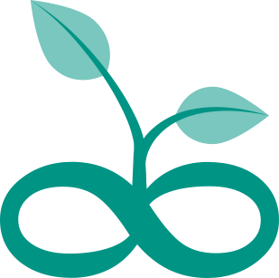

# A New Chapter for ClimateTriage

__Tobias Augspurger__  [:fontawesome-brands-linkedin:](https://www.linkedin.com/in/tobias-augspurger/) · __Chris Harris__ [:fontawesome-brands-linkedin:](https://www.linkedin.com/in/chris-harris-11512878/) · __Michael Scheiwiller__  [:fontawesome-brands-linkedin:](https://www.linkedin.com/in/michael-scheiwiller-72086a1a0/) · __Andrew Nesbitt__  [:fontawesome-brands-mastodon:](https://mastodon.social/@andrewnez) · __Richard Littauer__ [:fontawesome-brands-linkedin:](https://www.linkedin.com/in/richard-littauer-130026138/) · __Thomas Gram__ [:fontawesome-brands-linkedin:](https://www.linkedin.com/in/thomasegebrandgram/)
:octicons-calendar-25: April 21, 2025

---

We are launching a new chapter of [ClimateTriage](https://climatetriage.com/) as part of the GitHub [Climate Action Plan for Developers](https://github.com/social-impact/focus-areas/environmental-sustainability/climate-action-plan-for-developers), launched at the San Francisco Climate Week. Together with GitHub, we are joining forces on a common mission: To get more developers involved in open source climate and sustainability projects. 

### Why?
Because there are few similar fields where an individual's contribution can have a greater impact on preserving natural resources and sustainability for future generations. Whatever your skill set, we can help you find an open source or open data community where you can contribute evidence-based, collaborative insights to fight climate change and natural destruction. Over the years, we've seen thousands of developers change the way sustainability is valued, making it more trustworthy and transparent in an open source way. ClimateTriage also serves as an ideal filter for active projects with an open and growing community, highlighting projects in the OpenSustain.tech database that welcome new developers to join the projects and can be guided by the community with Good First Issues on how to get involved.

### GroundTruth 
In addition to GitHub, another partner is helping to scale this initiative. Chris Harris, tree-planting veteran and founder of [GroundTruth](https://groundtruth.app/), will represent ClimateTriage and OpenSustain.tech at the SF Climate Week event on-site, sharing his unique insights on how earth observation, open source, and open data are transforming reforestation and the trustworthiness of carbon credits. He made the long trip from Vancouver to show how data and code are not stuck in academia, but can change the way the quality of sustainability projects are assessed.

<figure markdown="span">
  { width="200" }
</figure>

### What’s New?

So what have we improved since launching the first prototype more than one year ago? 

* The underlying OpenSustain.tech database that we scan for Good First Issues has reached nearly 2500 projects, all of which have been reviewed by at least 2 experts in the field. This was also made possible by a team at GitHub who helped us find even more healthy projects in this area over the past year.

* Thanks to the backend provided by [ecosyste.ms](https://ecosyste.ms/), Good First Issues can now be filtered by project age and download count. We have done everything we can to capture all Good First Issues and comparable labels and make them available to you, including those from other coding platforms.

* A community chat to help contributors find projects and organizations they can help. If you are new to open source or an expert, you are invited to match your ideal contribution to the space. We have learned that the unique insights we have gained from reviewing and investigating thousands of projects in the space can help others find the ideal projects. A search engine is sometimes not enough, so we offer real people to help match people and projects. Join our open community chat for free advice on where to start and where your skills are most needed: Join our [Community Chat](https://discord.gg/JDUatGKxve).

### What’s Next?

To improve the user experience and reach of Good First Issues in Climate and Sustainability, we have several new features in development that will be integrated soon:

* ClimateTriage will act as a relay to our social media channels on Mastodon and Bluesky, pushing all new Good First Issues to various social media platforms to increase the reach and involve more contributors. 

* Together with ecosyste.ms we are investigating several health indicators using the issue frequency and number of developers involved to determine which projects need urgent support, making ClimateTriage a true triage system.

Looking to make a difference? Start your open source journey in climate and sustainability. Explore the latest Good First Issues from open source initiatives focused on conserving natural resources: Visit [ClimateTriage.com](https://climatetriage.com/).

