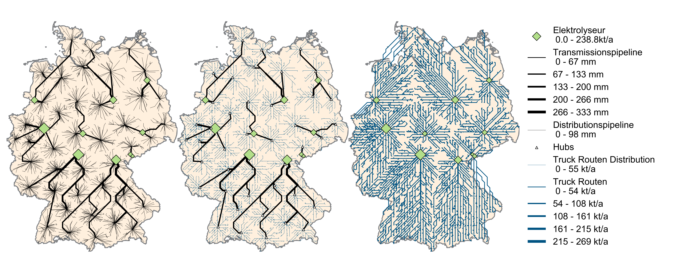
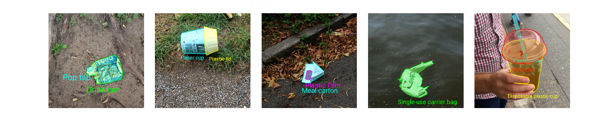

# Gathering Open Sustainable Technology

 __Tobias Augspurger __  [:fontawesome-brands-twitter:](https://twitter.com/protontypes) · __Tjark Döring__ · __Felix Dietze__ · __Johannes Karoff__ · :octicons-calendar-24: October 20, 2020

As climate change is a globally emerging challenge, protontypes is starting the unique attempt to map all open sustainable technology in one list. Surprisingly, we have not found anything similar. In our mission to accelerate open sustainable technology, we recognize that it is difficult to get an overview of open technology in sustainable areas such as renewable energy. That's why we started this list to gather all awesome sustainable technology:

## The Relation between Sustainable and Open Technology

In the scope of this list we define sustainable technology as follows:

> Technology to preserve global energy supply and vital natural resources. 

For technology to be truly sustainable, everyone must have access to it and be able to adapt it to their needs. Especially in the development of sustainability technology, we need to be fast and efficient. By spreading knowledge in this domain with open software, standards, tools, and platforms a sustainable economy can be reached in a short timespan. Open source is part of this process and helps us to save time by not reinventing the wheel.

Countries such as Germany or the United Kingdom now generate most of their electricity from renewable energy sources and show how to successfully maintain a large-scale renewable energy supply. [[1]](https://www.rechargenews.com/transition/germany-s-renewable-power-share-surges-to-56-amid-covid-19-impact/2-1-837212)
Making their technology open to everyone will increase our chance to reach our climate goals.

<figure markdown>
  
  <figcaption> <a href="https://github.com/FZJ-IEK2-VSA/HIM">Open Hydrogen Infrastructure Model of Germany created by Juelich Research Centre</a> </figcaption>
</figure>

In technology domains like web technology, artificial intelligence, or high-performance computing the success of open and independent standards, frameworks and methods can also be seen today. All the giant Internet companies build their platforms based on free and open technology like Docker, Linux, Python, React, Kubernetes, or TensorFlow [[2]](https://protontypes.eu/about_free_innovation/). Can these success stories inspire us in our most vital challenges today?

## Deep Dive into Open and Sustainable Technology

In our search for open and sustainable technology, we have come across a number of very ambitious and high-quality projects. Unfortunately, there was no sign of activity in most of them. Many of these projects are open source but hard to find. As there is no project index in this area so far, it is not easy for developers worldwide to find these "gems" and to build upon the work already done. This results in time loss and inhibits innovation. Focussing on active projects helps us to ensure active communication and knowledge transfer.

Many domains already show the emergence of strong communities. Based on our research, we were able to identify a general trend towards open and sustainable technologies. In the last two years, in particular, a large number of astonishing projects have been developed. In particular, the photovoltaic and wind turbine sector shows a large number of professional projects. It was very impressive to see a 15-MW offshore wind turbine, which was developed in cooperation between the National Renewable Energy Laboratory and the Technical University of Denmark. Almost all technical documentation has been provided under the MIT Open Source License [[3]](https://github.com/IEAWindTask37/IEA-15-240-RWT). This standard will allow companies and research institutions to further develop and use this technology without major intellectual property barriers. Many tools around the development are also available under an open license. On the basis of these technologies, it is possible to secure a large part of the energy supply for entire coastal regions. Although this is a historic step, the 62 stars on GitHub indicate how little attention is still paid to this field. 

<figure markdown>
   
  <figcaption> <a href="https://github.com/IEAWindTask37/IEA-15-240-RWT"> 
A CAD model of the nacelle layout of the 15-MW direct-drive wind turbine. 
</a>
 </figcaption>
</figure>

## Hidden Gems 

In the field of energy system modeling and climate research, we found some larger communities and projects which have evolved over a long period of time. Many high-quality data sets can be found in this area. Unfortunately, even after intensive research, some areas are still very thinly covered.  These include the areas of energy storage, carbon capture, bioenergy, recycling, and waste. Especially in the area of waste classification by artificial intelligence, we expected a lot of software and datasets. The sad truth is that there are hundreds of large open source projects to classify and track people, but only a handful for classification and segmentation of waste within an image. Even the largest project in this field, called TACO, seems to be unable to get the attention it deserves and has no sponsors today [[4]](http://tacodataset.org/).
In general, the impression is that most projects are developed further by public institutions, research institutes, and private individuals. Large companies can only be found in a few places. The global impact of companies investing in open sustainable projects is much larger when enabling others to do the same. 

<figure markdown>
  
  <figcaption> <a align="center" href="https://github.com/pedropro/TACO">Segmantation and classification of litter with TACO</a>
</a>
 </figcaption>
</figure>

## A Direct Comparison 

Since protontypes also maintains an awesome list in the field of robotics, we are able to make a direct comparison between the two fields. The number of active and high-quality projects maintained by a worldwide community is significantly larger in robotics [[5]](https://github.com/protontypes/awesome-robotic-tooling). Many projects build upon each other and simplify research and development. If we had the same level of activity and contribution within the field of sustainable technologies, we would be very confident that climate change and the loss of natural resources can still be averted. 

Through our organization protontypes we will accelerate the trend towards open and sustainable technology. The list of awesome sustainable technologies is the first central piece of the puzzle that was missing. In this way, we hope to increase the transfer of knowledge in this area and help others identify areas not covered by open toolkits and data sets. Especially in the field of software development, this will enable people around the world to tackle one of the most central problems of our time from the comfort of their own homes. The strength of open development methods is already clearly visible in many high-tech areas. Let's concentrate this strength on one of the most central problems of our time.
