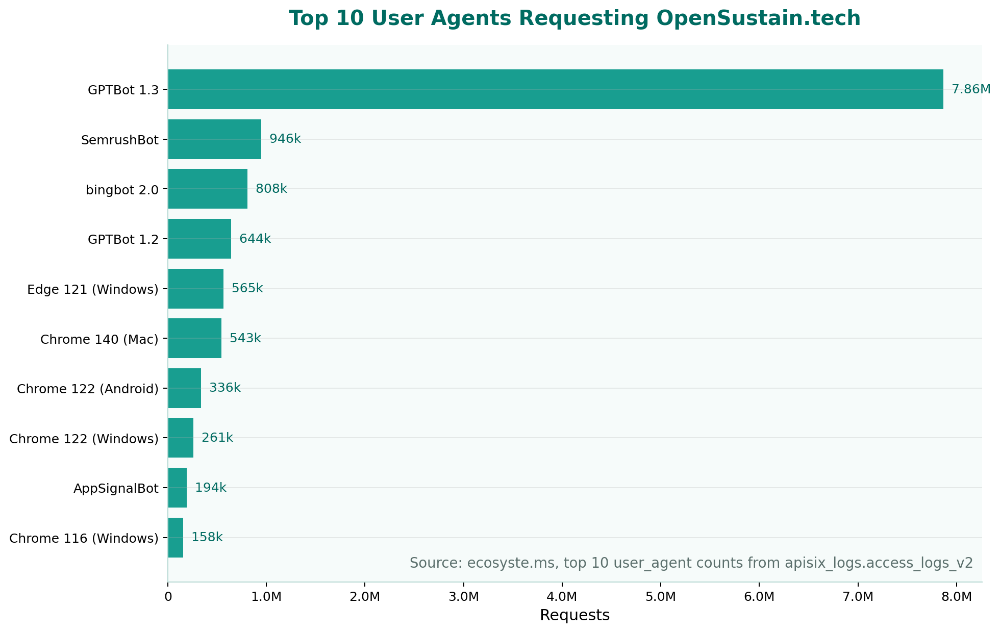

# How Volunteers Power the Climate Intelligence of Generative AI Models
__Abdul Salam Issahaku__  [:fontawesome-brands-linkedin:](https://www.linkedin.com/in/abdul-salam-issahaku-52ab4b228/) · :octicons-calendar-24: March 26, 2026

**TL;DR:**

Public online datasets for AI model pre-training and fine-tuning have evolved from generic web-scraping to precision harvesting. OpenAI’s GPTBot alone made millions of requests to OpenSustain.tech in four months, seeking high-quality, human-curated sources of truth for its knowledge on climate and environmental sustainability. The financial and operational burden falls on open-source volunteers. Processing this surge costs roughly €50/month in server fees.

AI isn't just an extractor; it is a force multiplier for Citizen Science. It automates data verification, lower the barrier for new contributors and can help volunteers scale their impact if the relationship moves from extraction to reciprocity.

For the AI industry to remain accurate and ethical, it must reinvest in the open data infrastructure it relies on. We don't need to block the bots, we need to build a sustainable engine for the knowledge that powers them.

## Introduction

It is not a hidden fact that data is the fundamental component of large language models. They serve as the oxygen that powers training, performance, and application. Data is used throughout the AI development process, from training to testing to validation. The quality, quantity, and diversity of data directly determine a model's capabilities, accuracy, and tendency toward bias. The industry is moving beyond just using more data. According to a 2026 [study](https://arxiv.org/html/2502.01968v3) by Pang et al., better data, high-quality, clean, and well-curated datasets, are critical for competitive LLM performance, as data quality matters far more than quantity in supervised fine-tuning.

## The New Scraping Paradigm: Why Volunteer Data Matters

Public online datasets are one of the main sources of AI training data, and they were traditionally accessed through platforms like Wikipedia and Common Crawl. With the advancement of the generative AI ecosystem, attention has shifted to high-quality sources such as FineWeb (filtered Common Crawl), specialized public datasets on Hugging Face or Kaggle, and highly curated open-source data for improved precision in training and fine-tuning.

AI companies now have their own agents used to access these platforms and public APIs, giving them control, quality, and recency. These bots can broadly be categorized into three categories:

1. Training bots: Specialized at scraping data used for model training. Examples include ClaudeBot, GPTBot, Meta-ExternalAgent.

2. User bots: Used for real-time page fetching when users ask a question in chat. Examples: ChatGPT-User, Claude-User.

3. Search bots: Used to discover and index websites for inclusion in AI responses. Examples: OAI-SearchBot, Claude-SearchBot

This blog is focused on training bots. Models like the early versions of GPT or Llama are trained on snapshots of the internet, massive, messy dumps of data from non-profits like Common Crawl [(Mozilla’s analysis of Common Crawl’s role in generative AI
)](https://www.mozillafoundation.org/en/blog/Mozilla-Report-How-Common-Crawl-Data-Infrastructure-Shaped-the-Battle-Royale-over-Generative-AI/#:~:text=Moreover%2C%20the%20methods%20used%20by,by%20humans%20in%20equitable%20ways.). This method was generic scraping; a wide-net approach that gathered everything from Wikipedia articles to restaurant reviews. In this era, your website's data likely trickled into AI models through these general archives.

Generic data is no longer enough for these AI systems, as the ecosystem has advanced. To provide accurate answers on carbon footprints, renewable energy grids, or biodiversity loss, AI needs more than just a snapshot of the web; it needs a source of truth, which brought forth to these AI training agents/bots.

Tabular representation of The Shift in Strategy

Feature| The Old Way (Pre-2022) | The AI Bot Way (Now)
---|---|---
Data Source| Open Archives & Search Spiders| Specialized AI Training Crawlers
Scale |  Massive | Smaller
Quality control | Limited | High
Freshness| Delayed | Real-time
Custom targeting | No | Yes
Competitive edge |Shared | Unique
Access Control  | Websites explicitly didn't opt-in for use | Websites can controll access via robot.txt

This strategic shift marks a transition from indiscriminate web scraping to the selective use of high-quality, community-curated data. Volunteer-driven repositories, built out of commitment to open knowledge, are now powering the next generation of AI models. Instead of relying on vast but noisy internet archives, AI developers are tapping into focused, carefully maintained datasets that reflect real-world expertise and up-to-date information. The collective efforts of volunteers, often invisible, have become the backbone of accurate and reliable climate intelligence in generative AI.

Through this new strategy, AI companies are increasingly utilizing massive, volunteer-run databases, never originally designed for machine learning. This is how volunteers are quietly funding the intelligence of these models with their time, passion, and local expertise.

## The Discovery at Open Sustainable Technology

[ecosyste.ms](https://ost.ecosyste.ms/) Cloudflare cache indicates that GPTBot made about 8.5 million requests to [Opensustain.tech](https://opensustain.tech/) via [ost.ecosyste.ms](https://ost.ecosyste.ms/) in 4 months (This accounts for approximately 20% of the total requests). The multi-billion-dollar AI industry is getting this climate and environmental sustainability IQ for free. This is good news for us in the sense that our goal has always been to facilitate the accessibility and visibility of projects in the areas of climate change, sustainable energy, biodiversity, and natural resources.

<figure markdown="span">
  
</figure>

Open Sustainable Technology is a prime target for three specific reasons:

1.  Human Curation: Every entry in our directory has been verified by a volunteer. For an AI, this is Clean Data, the most valuable resource in existence because it eliminates hallucinations.

2. Topic Density: In a world of digital noise, our API is a concentrated well of environmental sustainability intelligence. A single bot hit on our platform provides more value than crawling a thousand random blogs.

3. Real-Time Accuracy: Climate and environmental sustainability data changes fast. AI bots now hit our API directly to ensure their climate IQ is up-to-date, rather than relying on a six-month-old web archive.

However, the shift from generic to targeted has created a massive imbalance. In the old days, being scraped meant you showed up in a search engine, which sent traffic back to your site. This was a fair trade.

Today, GPTBot isn't looking to send us traffic; it’s looking to absorb our knowledge into a proprietary model. We are seeing millions of hits (including cached requests) on our volunteer infrastructure, but the value only flows one way, from the volunteers who curate the truth to the corporations that sell the intelligence.

## Who Bears the Cost of AI’s Education?

When a bot like GPTBot makes millions of requests to a volunteer-run API, the bill doesn't go to Silicon Valley. It lands on the desks of the people maintaining the data.

[ecosyste.ms](https://ost.ecosyste.ms/), estimated that processing these requests costs roughly €50 per month in additional server and infrastructure fees. While that sounds like a small number to a corporation valued at billions, it is a significant burden for a project run entirely on volunteer time and donations.

### The Data Tax on Volunteers:

**Financial Drain**: Volunteers are literally paying out of their own pockets to keep the servers running so that AI models can learn.

**Operational Stress**: High traffic volumes require constant monitoring and technical adjustments to prevent the site from crashing, stealing time from actual data curation.

**The Reciprocity Gap**: Unlike traditional search engines that pay in traffic and visibility, AI bots extract the knowledge into a closed model. The volunteer gets the bill; the AI company gets the asset.

This is a systemic flaw in the current AI boom. We are subsidizing the environmental sustainability IQ of proprietary models with the limited resources of the global commons.

We must acknowledge the value loop. AI isn't just taking from the commons; it is increasingly becoming a tool that empowers the volunteers of the Open Climate movement.

The goal isn't to block AI; it's to create a Symbiosis. We provide the high-quality, human-curated source of truth that AI needs to be reliable. In exchange, AI provides the computational power that volunteers need to scale their impact.

## Conclusion

The Business Bet of the century, building trillion-dollar intelligence on top of human-curated knowledge, is currently missing a foundation of fairness. If we continue to allow AI giants to harvest the commons without reinvesting in them, we risk an era where the very sources of truth that AI depends on eventually wither away from lack of support.

We could have simply blocked the bot, but we don't want to go in that direction. We want the AI to be smart, accurate, and helpful in the fight against climate change. But Traceable Sustainability requires a sustainable economic model.

The Path Forward:

Companies like OpenAI and Anthropic must create structural support systems for the high-value datasets they crawl.

Open data infrastructure like Open Sustain Technology must be recognized and protected as critical infrastructure for the planet.

If you work at an AI lab, ask how your data is sourced. If you are a developer, join us in building the Welcome Mat for the next generation of environmental sustainability.
