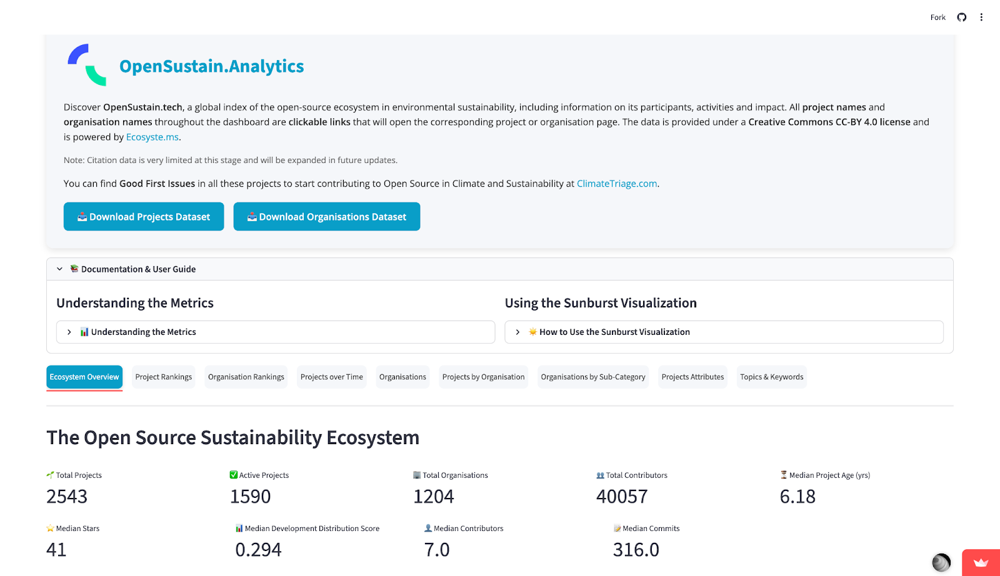

# Introducing OpenSustain Analytics:  Now We can Finally Quantify the role of Open Source in the Climate Movement
__Abdul Salam Issahaku__  [:fontawesome-brands-linkedin:](https://www.linkedin.com/in/abdul-salam-issahaku-52ab4b228/) · :octicons-calendar-24: February 26, 2026

<figure markdown="span">
  
  <figcaption>  </figcaption>
</figure>

I’ve always asked myself as a developer whether my code is actually contributing to sustainability or the other way round: running on dirty servers and advancing business interests that don’t align with the domain I am so enthusiastic about.

The efforts towards sustainability felt to me like a vast, largely unexplored territory. I knew there were people building energy models, grid analysis tools, remote sensing tools, water sensors, carbon trackers, etc., but they were scattered across thousands of repositories. I had a sense that I could use my open-source developer time to address sustainability issues, but finding them was a bottleneck; understanding which projects might have an impact, as a non-scientist, was nearly impossible.

Then I found Open Sustainable Technology (OST). The team of volunteers had built a directory that answered my user need: a repository of open-source projects in the area of environmental sustainability. At first, I thought I would just show up, use the directory, and contribute a few patches to the codebase, but I realized the team was building something much deeper: a global index and analytics engine designed to answer the very questions I’d been asking myself.

The team has taken years of manually curated, high-fidelity data and turned it into a living lens. In this blog post, I want to share the insights I have gained from an incredible experience contributing to this tool.  I think that the tool, and its content can not only help individual developers find their way, but help organizations and governments understand the current landscape of the open-source movement in environmental sustainability.

## The Tool: OpenSustain-Analytics
When we think about climate action, typically we think of engineers and software developers building the models, packages, energy grid simulators, and biosphere monitors we need to survive this century (Why Software in Climate Matters, Withearth, 2024)​ [withearth.substack](https://withearth.substack.com/p/why-software-in-climate-matters). But underneath these tools, the open-source movement drives the hidden engine of climate technology.

However, the community has not yet had the opportunity to thoroughly evaluate the reliability of that engine. The OST volunteers have gathered over 2500 open source projects used to support climate change mitigation, sustainable energy, biodiversity, and natural resources.

<figure markdown="span">
  
  <figcaption>  </figcaption>
</figure>

To make it easier for developers, potential funders or newcomers like me to figure out what is going on in Open Source in Climate, I joined a team building the OpenSustain Analytics dashboard.  Open Source for sustainability is like other open software ecosystems, where it's hard to prioritize volunteer time and investment across thousands of potential software projects.  The Dashboard can help build the empirical foundation required to direct resources effectively in the climate fight.

The Dashboard uses the manually curated datasets of organizations and projects in the Open Sustain Tech ecosystem, to create an up-to-date and ready to explore framework for anyone to understand the dataset. The analytics tool provides users with a dynamic, collaborative workspace to quantify the health, impact, and growth of the open-source movement in climate change mitigation and sustainability.

### Ranking and Evaluation Methodology
The most novel feature of [OpenSustain Analytics](https://opensustain.tech/analytics/) is a comprehensive metric, the Total Score, to evaluate and rank projects and organizations based on their activity and impact. This score is a composite indicator derived from the aggregation of multiple normalized (min-max scaled) quantitative signals.

* Number of contributors
* Total commits
* Github Stars
* Ecosyste.ms Score
* Total dependencies
* Citations
* Development distribution score
* Downloads

This multi-factor approach offers a quick way to understand a project’s overall health and impact than relying solely on a single indicator like star count.

### Components
The dashboard is interactive and allows for deep dives into the data through various tabs, indicating the breadth of the underlying dataset.

| Dashboard Tab                 | Focus of Analysis                                                                                                                                                                                |
|-------------------------------|--------------------------------------------------------------------------------------------------------------------------------------------------------------------------------------------------|
| Overview                      | Showcases the core metrics that confirm the scale and robust health of the movement, and a Sunburst chart provides a hierarchical view of the open-source sustainability ecosystem.              |
| Project Rankings              | Comparative performance of projects based on the Total Score and other metrics.                                                                                                                  |
| Organisation Rankings         | Comparative performance of organizations, with filtering options by country and organization type.                                                                                               |
| Projects over Time            | Trend analysis of project creation and activity, useful for tracking ecosystem growth.                                                                                                           |
| Organizations                 | Ecosystem insights based on the attributes of an organization’s Git namespace. It includes insights like the total number of projects per country, top organizations by Number of projects, etc. |
| Projects by Organization      | Sunburst showing larger organisations (≥2 projects) and their projects                                                                                                                           |
| Organisations by Sub-Category | Breakdown of organizational involvement across specific sustainability domains.                                                                                                                  |
| Topics & Keywords             | Identification of the most common and emerging themes within the projects.                                                                                                                       |
| Projects Attributes           | Detailed analysis of technical and structural characteristics of the projects.                                                                                                                   |                                                                                                              

## Core Insights into the Movement

The true power of the OpenSustain Analytics dashboard gives us the empirical foundation to have a clear picture of the current state of the movement. Giving the community an opportunity to move from simple curiosity to a data-driven investigation, revealing critical insights that changed the view on open-source climate action.

As a newcomer to the sustainability tech space, I was full of curiosity. Here are the questions the data helped answer and the realities they revealed:

### Are most open source  projects just passion projects destined to fade?

It’s easy to start a GitHub repository, but maintaining a complex climate model or energy grid simulator for years requires dedication, funding, and a robust community. I worried that many of these critical projects were just passion projects destined to fade after a few months. The “Ecosystem Overview” tab immediately put this fear to rest. The median project age is 6.2 years, and the “Projects Attributes” tab shows that 63% of the 2,539 indexed projects are active (with a commit in the last year). 

<figure markdown="span">
  
  <figcaption>  </figcaption>
</figure>
<figure markdown="span">
  
  <figcaption>  </figcaption>
</figure>

The open-source sustainability ecosystem is not a collection of ephemeral experiments but a mature, actively maintained body of work built on years of sustained effort. This maturity is the foundation upon which investors, policymakers, and new contributors can confidently build.
This makes me feel optimistic about the future of the movement and also appreciate the potential of our tool in deriving these kinds of analyses, knowing that there are like-minded individuals in other parts of the world who are eager to protect the environment through open-source technology. 

### Where is the “Technical Gravity” pulling us?

Whenever someone proposes a new piece of technology to “solve climate," part of me wants to understand: “Are we just building what’s “cool,” or are we building what the planet needs?”

By using our sunburst analysis, we can see the exact distribution of effort. The sunburst chart itself is an interactive, multi-layered interface that presents a hierarchical view of the open-source sustainability landscape. Users are not simply presented with static data; they can navigate across different major categories and drill down into their specific subcategories and projects, revealing the hidden structures and dependencies within the movement.

An immediate observation from the sunburst's outermost layer reveals where the movement's focus currently lies. Two main categories, biosphere and climate change modeling, exert a massive "gravity," with more projects. This concentration of effort suggests that the community is prioritizing foundational work: understanding the planet's vital systems and developing sophisticated, open-source models to predict and simulate future climate scenarios.

While celebrating this robust effort, the closer inspection offered by the sunburst analysis is perhaps most valuable for what it doesn't show. When navigating to the less-developed segments of the chart, clear and significant gaps become apparent. The data suggests an imbalance: while the open-source community excels at building the tools for understanding the problem (modeling, data analysis, core science), there is a notable lack of mature open-source tooling for several critical, action-oriented categories.

This revelation is crucial for strategic planning. This sunburst tool effectively acts as a dynamic heatmap, illuminating the “white space” for the next generation of developers, researchers, and project maintainers. These identified gaps represent untapped opportunities where new, impactful projects are urgently needed. The quantification of this effort not only validates the work being done but, more importantly, provides a data-driven compass for directing future resources and collaboration toward the areas of greatest strategic necessity.

<figure markdown="span">
  
  <figcaption>  </figcaption>
</figure>

The current analysis confirms that the movement is fundamentally rooted in data and scientific modeling:

**Topical Focus**: Energy systems, climate change, and the biosphere dominate the distribution of projects, with keywords like “energy,” “climate,” and “water” being the most frequently extracted.

<figure markdown="span">
  
  <figcaption>  </figcaption>
</figure>

**Ranking Validation**: The platform’s composite ranking highlights projects that serve as scientific infrastructure. Top-ranked projects like xarray (the foundational Python library for multi-dimensional climate data) and OpenQuake (natural hazard risk assessment) demonstrate that high-impact open source in this space is defined by its utility in rigorous scientific workflows.

### Who are the real “Quiet Giants” of the movement?

We know the big tech names, but who is actually funding and hosting the code that climate scientists use?

From our current citation data, the rankings surprised me. It’s not just “Big Tech.” The movement is fundamentally driven by entities focused on public benefit and scientific research.

The ecosystem is led by non-commercial entities: community groups and academia are the primary organizational types, followed by strong participation from government agencies. For-profit organizations play a supportive but secondary role.

The National Renewable Energy Laboratory (NREL), now the National Laboratory of the Rockies (NLR), and rOpenSci are absolute powerhouses, consistently outperforming private entities in both project volume and community health.

This confirms the indispensable role of government and public research institutions in funding, developing, and hosting foundational open-source tools for renewable energy, grid modernization, and environmental science.

<figure markdown="span">
  
  <figcaption>  </figcaption>
</figure>

If you want to contribute where it matters, look to the institutions that treat code as a public service.

### Why is there a “Silent Barrier” for new developers?

I wondered why it felt so hard to jump into some of these amazing projects. We analyzed the “Social Attributes” of 2,500+ projects and found a glaring issue.
Based on our current citation data,
* 2,032 projects have no code of conduct.
* 1,675 projects lack a contributing guide.

This is the bottleneck I felt. The majority of these projects are not well documented. Our tool highlights this “governance gap,” showing that professionalizing the social side of climate tech is just as important as writing the code itself.

A lack of governance documentation threatens community inclusivity and developer retention. A project without a code of conduct is inherently less resilient, regardless of its code quality. This is an urgent call to action for the entire ecosystem, especially considering the spike in AI-aided coding.

<figure markdown="span">
  
  <figcaption>  </figcaption>
</figure>
Funding efforts must prioritize social infrastructure and code of conduct adoption to secure the long-term viability of otherwise healthy projects.

### Is this a global effort or a local one?

Climate change is a global crisis. Is the software to fix it being built globally?
This was the most sobering answer. The organizations are overwhelmingly concentrated in the USA and Europe. Representation from the Global South is critically low, with Asia and Africa having minimal organizational presence.

<figure markdown="span">
  
  <figcaption>  </figcaption>
</figure>

### What didn’t we get to?
Like every open-source project, we didn’t quite finish everything we wanted to do. Here are some ideas that I would love for future contributors to take up:

* UI improvement: So far we go very lean with the styling for the dashboard. Hence, contributions on improving the general theme of the tool are highly welcome, especially from someone with UX and data visualization experience.
* Extension of the citation data.
* Finding other bugs or features that would help other users!
* See the project’s open issues at: [Issues](https://github.com/protontypes/opensustain.analytics/issues)

### What are you going to do with the OpenSustain Analytics?

Contributing to this project changed how I see my role as a developer. I used to think I was just writing functions; now I realize I’m helping maintain a global ecosystem.

I have come to realize that I don’t have to be a master in programming to contribute to the cause. A lot of developers are doing it already, and the analytics have shown it all.
OpenSustain Analytics translates complex code metrics into clear, actionable insights.

* Through this tool, we can finally see the projects, the organizations, and the countries that are doing the work:
* Funders can use the rankings to direct capital toward resilient projects and prioritize funding for Code of Conduct adoption.
* Developers can identify high-leverage projects like contributions or use the Sunburst to spot underserved topical gaps.
* Policymakers can pinpoint thematic gaps or areas of strength in the digital public goods landscape.
* Journalists can easily quantify the scale and impact of the open-source climate movement, ensuring that critical technological efforts are visible and properly resourced.

