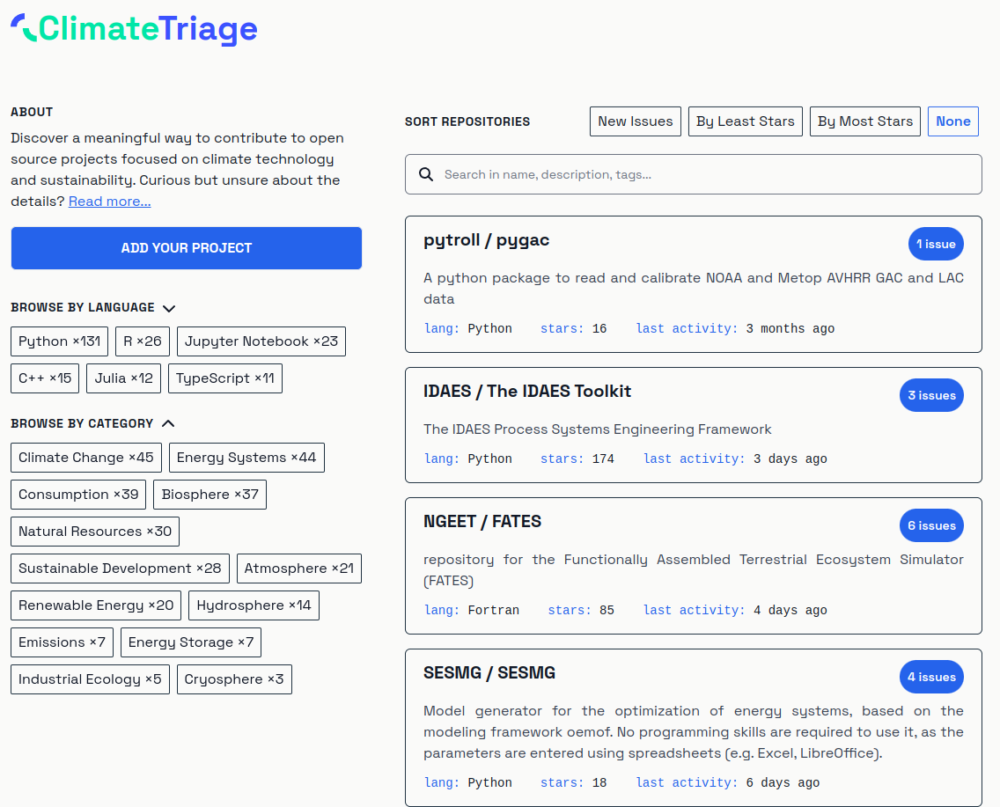

# Connect Developers with Impactful Sustainability Projects

 _Thomas Gram_  [:fontawesome-brands-linkedin:](https://www.linkedin.com/in/thomasegebrandgram/) · _Dan Brown_ [:fontawesome-brands-linkedin:](https://www.linkedin.com/in/dbrownusc/) · _Andrew Nesbitt_ [:fontawesome-brands-github:](https://github.com/andrew) · _Tobias Augspurger_ [:fontawesome-brands-linkedin:](https://www.linkedin.com/in/tobias-augspurger/) · _Josh Hopkins_ [:fontawesome-brands-linkedin:](https://www.linkedin.com/in/hopkins-josh/) · _John Metric_
 [:fontawesome-brands-linkedin:](https://www.linkedin.com/in/jmertic/)  
:octicons-calendar-24: December 19, 2023

Countless talented developers around the world are looking for ways that their talents can contribute to sustainability. The [LF Energy Open Sustainable Technology](https://lfenergy.org/projects/open-sustainable-technology/) project already offers a directory and analysis of the open source ecosystem in the areas of climate change, energy, biodiversity and natural resources. Despite this information being available on the wide range of open source sustainability projects, it can still be difficult for potential contributors to understand how they can get involved with these projects.

That is why [ClimateTriage.com](https://climatetriage.com/) is being launched as a dedicated platform focusing on the open technologies that help us to transparently understand and cooperatively manage the stability of our natural resources. Utilizing a statically exported Next.js build, this project offers a robust and scalable solution for connecting developers with impactful sustainability projects. The Open Sustainable Technology community works closely with the [Ecosyste.ms](https://ecosyste.ms/) platform, which provides metadata about the entire open source ecosystem and is therefore independent of the GitHub platform. At the same time, this will enable projects to be sorted by download numbers and other dimensions from a variety of package managers in the future.

Projects that are looking for contributors can visit the main repository at [Open Sustainable Technology on GitHub](https://github.com/protontypes/open-sustainable-technology), then follow the guidelines provided to submit their project. They should label issues as 'Good First Issue' or 'Help Wanted'. In this way, open source communities help new members to familiarize themselves with the project and thus contribute to the growth of a lasting community. Ecosyste.ms will do the rest in the background and the project should soon after appear on ClimateTriage.com.

Whether you are a seasoned developer or a newcomer eager to contribute, ClimateTriage.com provides a curated directory of impactful projects and a pathway to making your first meaningful contribution to open sustainable technology. Simply visit [the website](https://climatetriage.com/) and search for projects of interest to you to view what types of contributions they are seeking, then start contributing.

ClimateTriage.com is a collaboration of [Codeshark](https://codeshark.net/), [Ecosyste.ms](https://ecosyste.ms/), [Open Sustainable Technology](https://opensustain.tech/), [Open Corridor](https://opencorridor.org/) and [Linux Foundation Energy](https://lfenergy.org/).

<figure markdown>
  { width="600" }
  <figcaption> The ClimateTriage.com landing page at the launch date. </figcaption>
</figure>
