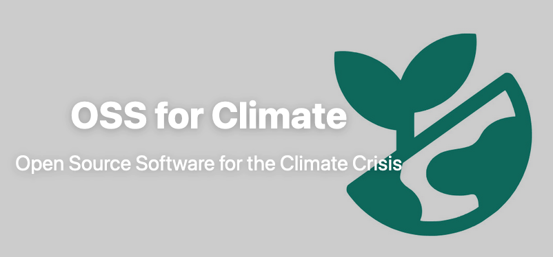
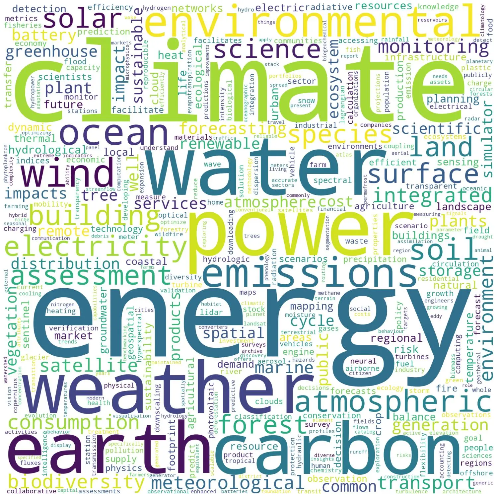

# Sustain Open Source, Sustain the Planet: A new conversation

 __Tobias Augspurger__  [:fontawesome-brands-linkedin:](https://www.linkedin.com/in/tobias-augspurger/) · __Richard Littauer__ [:fontawesome-brands-linkedin:](https://www.linkedin.com/in/richard-littauer-130026138/) · :octicons-calendar-24: June 14, 2024

 _Originally posted on [OpenSource.net](https://opensource.net/oss-for-climate-podcast/)._

Since 2017, [SustainOSS](https://sustainoss.org) has been a community of people who think about what we can do to make open source software more sustainable. We've talked about making better ways of compensate coders, building better communities, and welcoming more diverse voices into the open source ecosystem.

Many of these conversations have taken place on the [Sustain Podcast](https://podcast.sustainoss.org). However, almost none of these conversations have been about the intersection of open source and environmental sustainability.

<figure markdown="span">
  { width="600" }
  <figcaption>OSS for Climate Logo</figcaption>
</figure>

It's all over the news that software energy consumption is bad for the climate. What's rarely talked about, though, is how software actually enables climate science and sustainable technology, especially when it's open source. It's the glue that brings together scientists from all disciplines—biosphere, hydrosphere, atmosphere—to create the highly complex collaborative earth and climate models that allow us to forecast what our future might look like if we continue to behave as we have in the past. 

This is why we created the [OSS for Climate podcast](https://ossforclimate.sustainoss.org). The is a new initiative within the Sustain ecosystem hosted by [Richard Littauer](https://burntfen.com), the main host for the Sustain Podcast, who has recorded hundreds of conversations on this topic. The podcast is a collaboration with [OpenSustain.tech](https://opensustain.tech/), a free community accelerating open and sustainable technology. This podcast aims to fill the gap in discussions about how open source can be a key driver for climate action and sustainability.

## Shining a light on those who take action

OSS for Climate highlights individuals and projects, aiming to provide support in terms of funding, sustainability, and onboarding new contributors. It will explore the systematic changes open source can provide for climate action, addressing issues of transparency and trust, and emphasizing the critical role open source plays in our efforts to combat climate change.

We need a place to give a voice to the people behind the projects, to better understand their needs and perspectives on how open source can accelerate action on the climate crisis. Our first study, [The Open Source Sustainability Ecosystem](https://raw.githubusercontent.com/protontypes/open-source-in-environmental-sustainability/main/OpenSourceSustainabilityEcosystem_080423.pdf), showed us that such interviews are essential to understanding the very nature of open software's impact in this area. For this reason, we decided to combine the obvious synergies of our study with a podcast to make the interviews accessible to everyone.

That is why we started the Open Source Software for Climate podcast with Richard Littauer. He is the ideal voice to bridge the gap between what sustains the open source ecosystem and how open source can sustain the natural shared ecosystem on which we all depend. As an open source wizard, community builder, passionate birder, soon-to-be Ph.D. ecologist, and interviewer of more than 300 people in the open source community, there is no better host for this.

<figure markdown="span">
  { width="600" }
  <figcaption>Word cloud of the most frequently used words in the project descriptions on OpenSustain.tech</figcaption>
</figure>

## Comprehensive Coverage

On OpenSustain.tech we've listed around 1400 projects with an active community. Almost all of them are relevant to climate change. Even if you just look at climate models, the amount of software needed to make good predictions is significant. 

If you include everything that affects the climate, everything that is affected by the climate, and all the technologies needed to adapt to and combat climate change, you end up with a significant number of projects. Some of these are massive projects that are used by tens of thousands of developers; others are dependencies, part of the digital infrastructure that underpins our shared world. 

## Involving Diverse Stakeholders

Solving a global problem such as climate change requires global collaboration between different fields, making open source the most relevant methodology for combining knowledge and skills from different fields.

This includes not only scientists, but likewise entrepreneurs, activists, politicians and citizens who are empowered by open source to participate in the implementation of solutions. We want to know how open source can change the spread of climate solutions in the world, how climate justice can be archived by enabling access to technology and knowledge for those who are most vulnerable and affected. 

## Our mission

Our mission is to promote and support the entire open source community in the area of climate and sustainability. To do this, we combined data science based on open source analytics and data mining with [ecosyste.ms](https://ecosyste.ms/) to discover not just those who are the loudest, but the people who are making significant contributions in the background.

Stay tuned for insightful episodes that bring to light the important work being done in the intersection of open source and climate action. Listen to [OSS for Climate](https://ossforclimate.sustainoss.org) for a deeper understanding of how open source software can contribute to a sustainable future. Are you still on fire and want to find out more about how you can join our mission? Do you have a special person or project that you would like us to spotlight? Feel encouraged to contact [Richard Littauer](https://mastodon.social/@richlitt) directly or the [OpenSustain.tech community](https://mastodon.social/@opensustaintech) on Mastodon.
